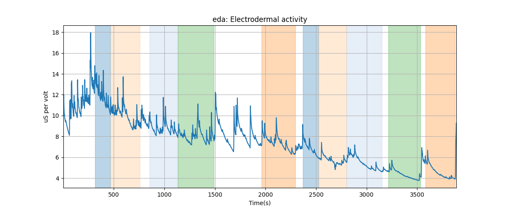
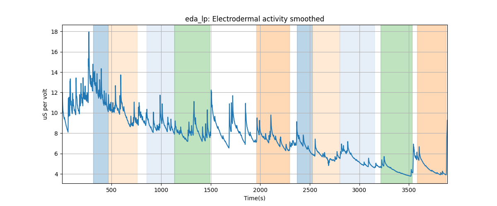
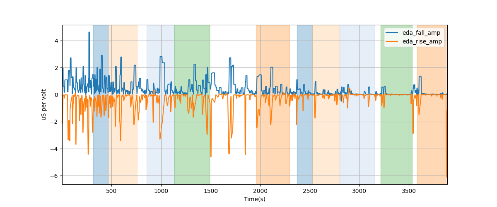
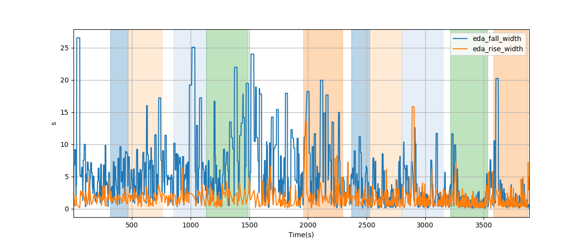
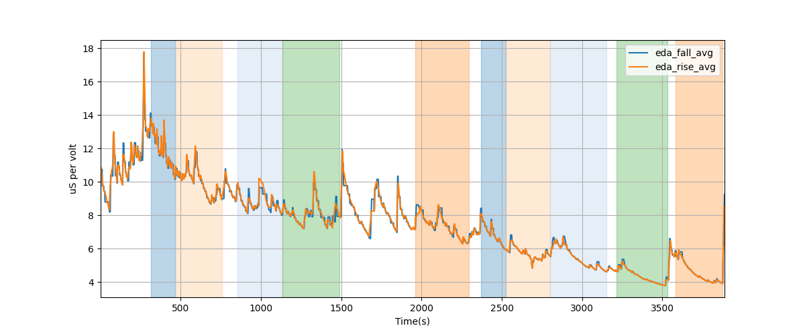

# Subject P015 Electrodermal activity data processing summary
Generated on 2024-10-01 11:51:15

## eda: Electrodermal activity

## eda_lp: Electrodermal activity smoothed

---
# EDA segment falling/rising wave amplitudes

---
# EDA segment falling/rising wave durations

---
# EDA segment falling/rising wave average amplitudes

---
# EDA segment falling/rising wave median amplitudes

