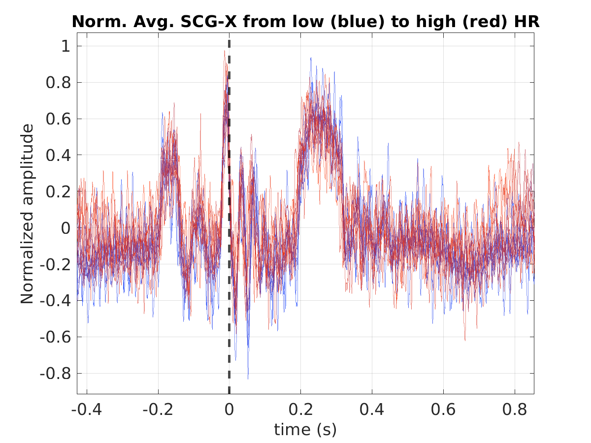
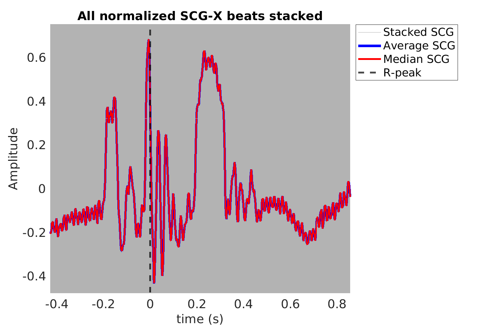
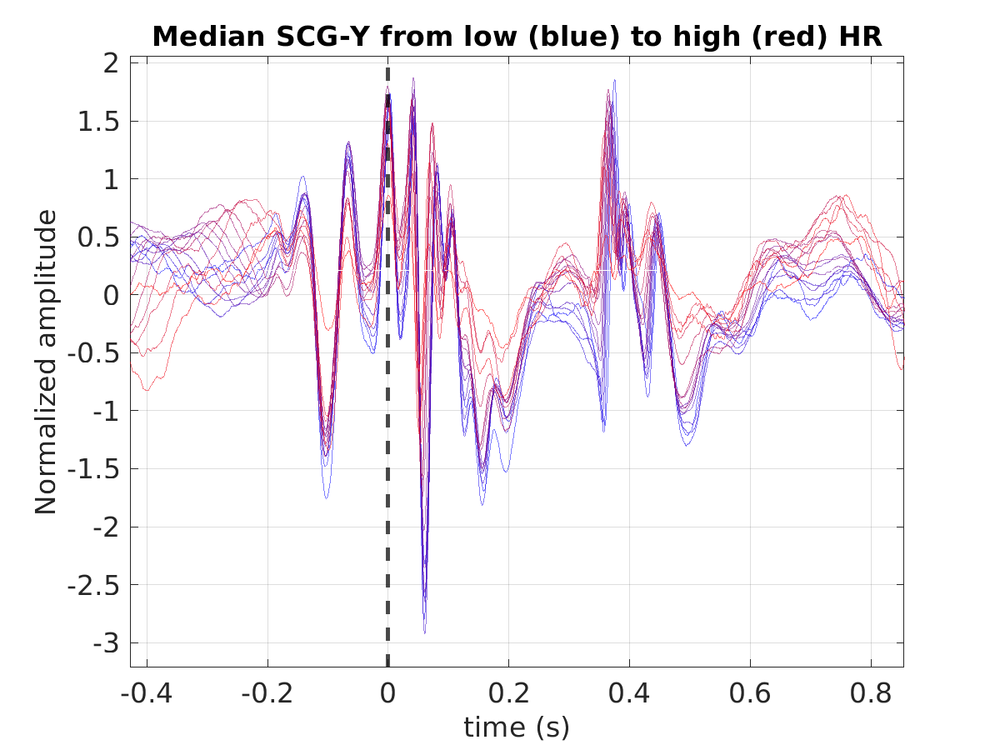
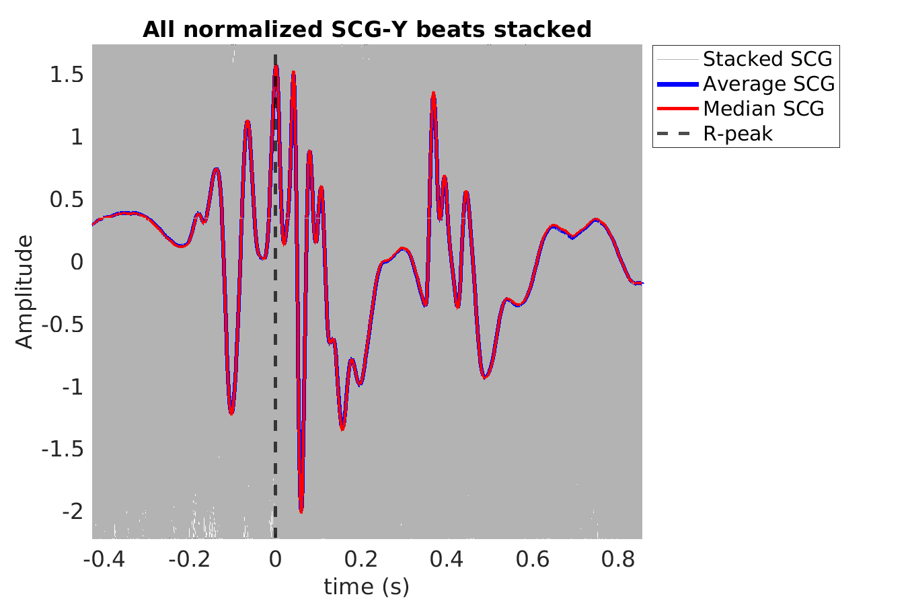
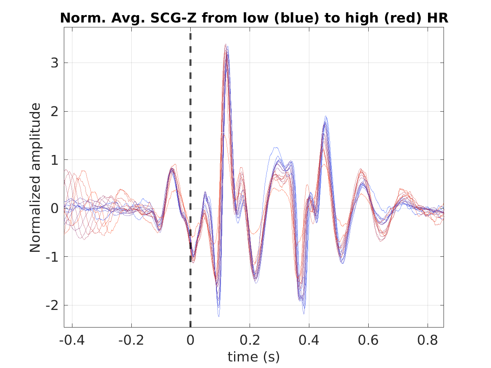
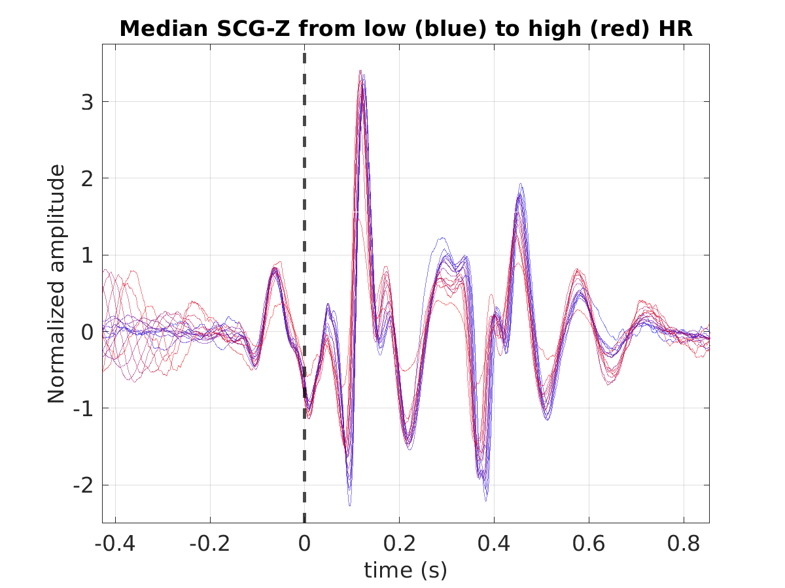
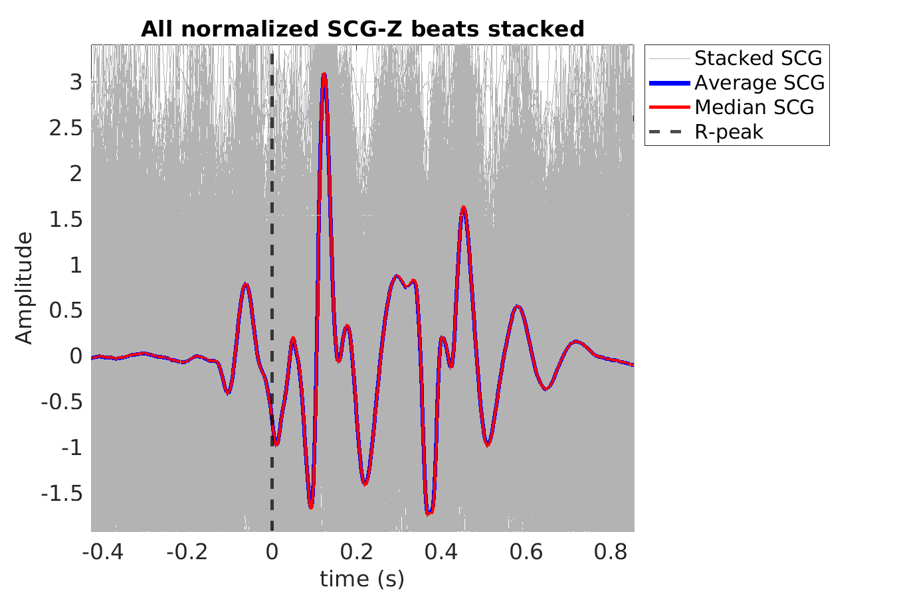
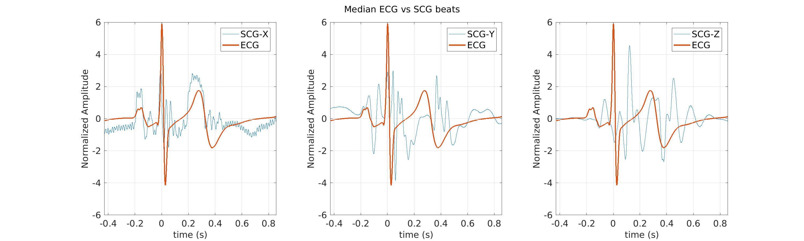

# Subject P015 seismocardiogram (SCG) data processing summary
Generated on 2024-10-01 11:51:13

## P015_scg_avg_scgx_hr_binned_norm

## P015_scg_med_scgx_hr_binned_norm

## P015_scg_scgx_stacked_norm

## P015_scg_avg_scgy_hr_binned_norm

## P015_scg_med_scgy_hr_binned_norm

## P015_scg_scgy_stacked_norm

## P015_scg_avg_scgz_hr_binned_norm

## P015_scg_med_scgz_hr_binned_norm

## P015_scg_scgz_stacked_norm

## P015_scg_avg_ecg_scg

## P015_scg_med_ecg_scg

