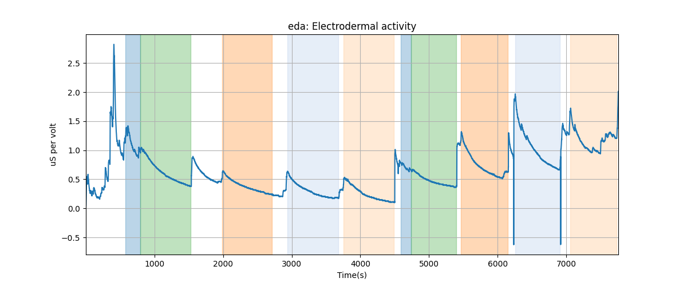
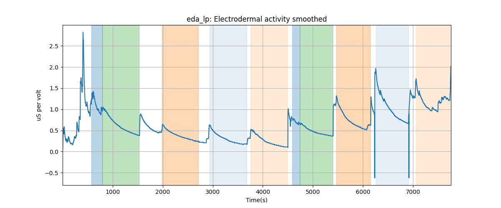
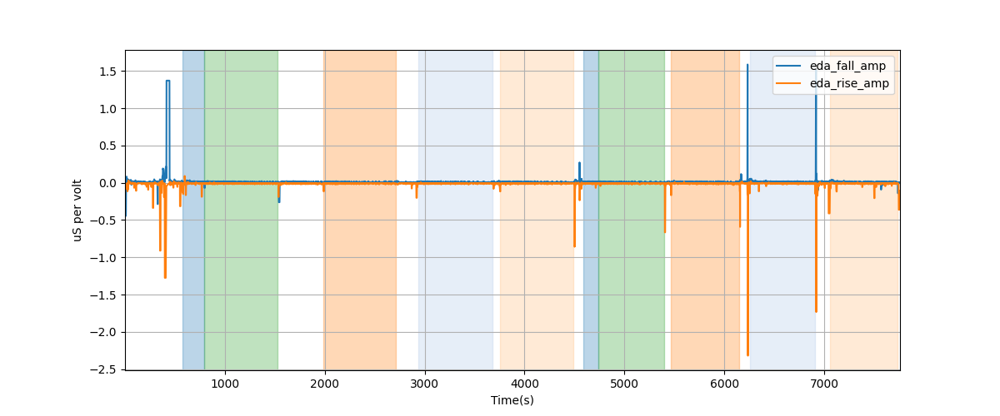
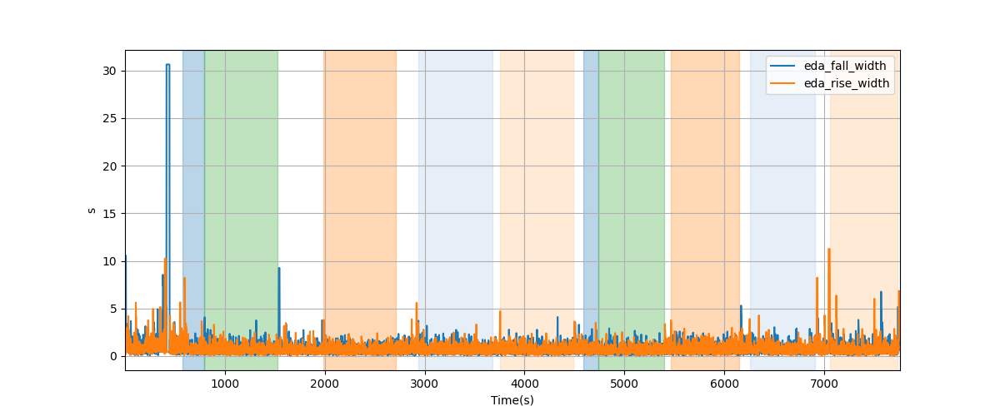
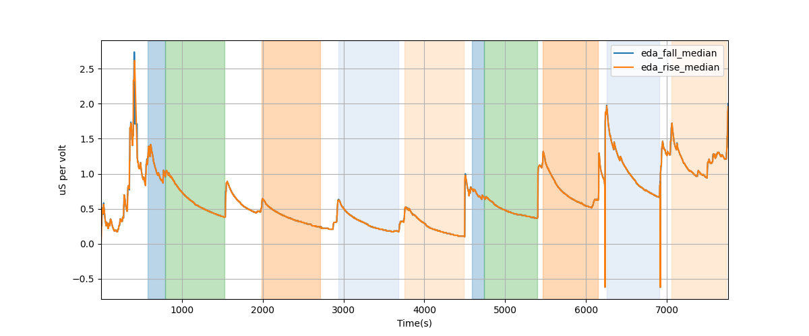

# Subject S003 Electrodermal Activity Data Processing Summary
Generated on 2024-09-10 09:22:21

## eda: Electrodermal activity

## eda_lp: Electrodermal activity smoothed

---
# EDA segment falling/rising wave amplitudes

---
# EDA segment falling/rising wave durations

---
# EDA segment falling/rising wave average amplitudes

---
# EDA segment falling/rising wave median amplitudes

