# Subject S012 ECG Data Processing Summary
Generated on 2024-08-30 16:08:55

## r_amps: R Amplitudes (mV)
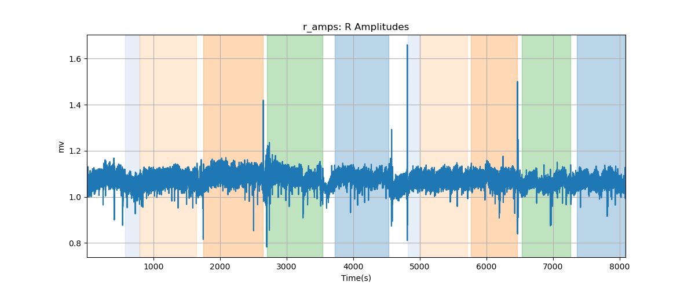

## hr: Heart Rate (BPM)
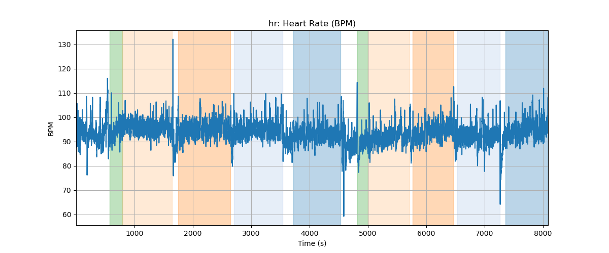

## hr_refined: Heart Rate Refined (BPM)
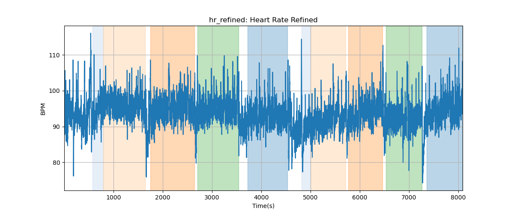

## hr_smoothed: Heart Rate Smoothed (BPM)
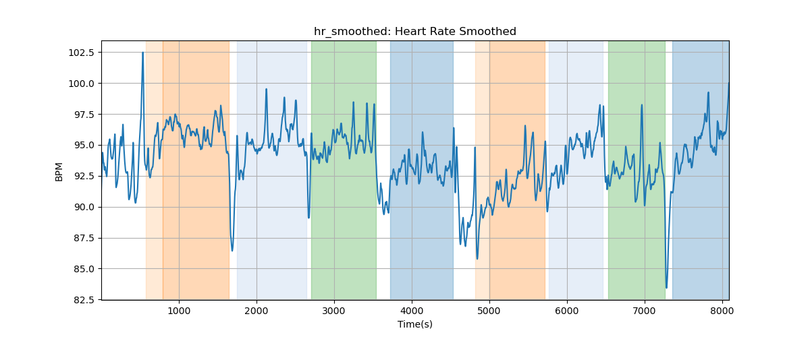

## rr: RR Interval (ms)
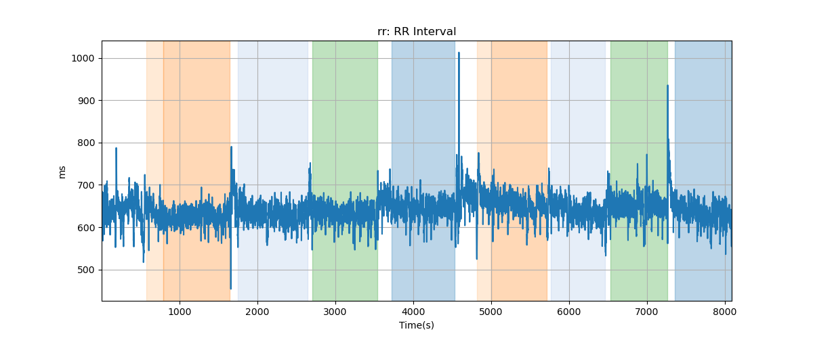

## rr_refined: RR Refined (ms)
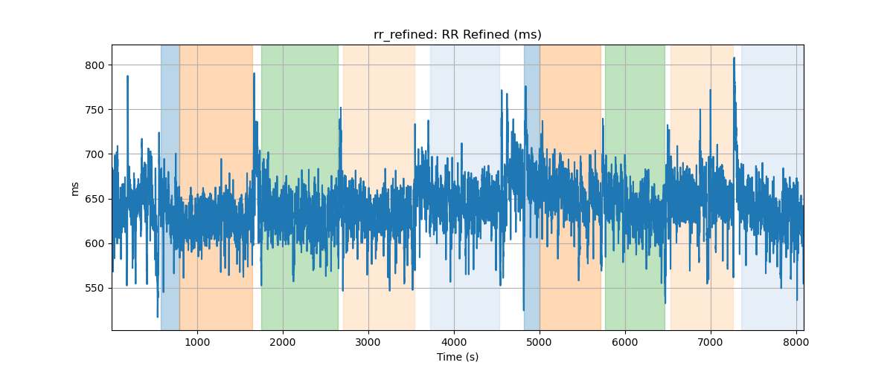

## rr_smoothed: RR Smoothed (ms)

## qt: QT Interval (ms)
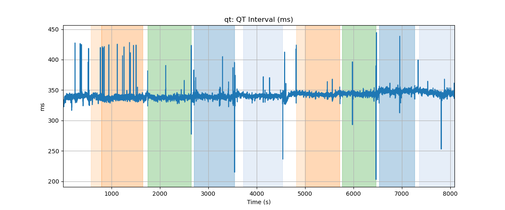

## qt_refined: QT Refined (ms)
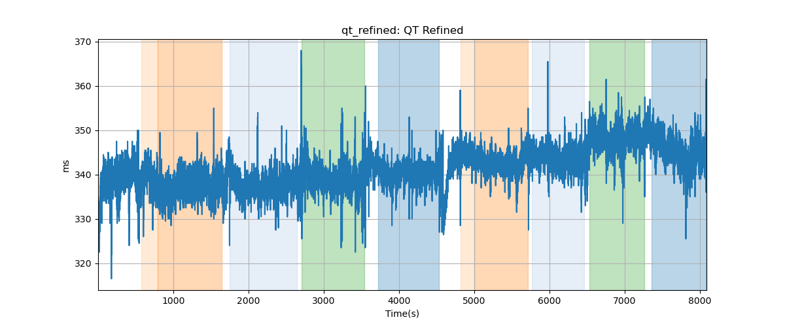

## qt_smoothed: QT Smoothed (ms)
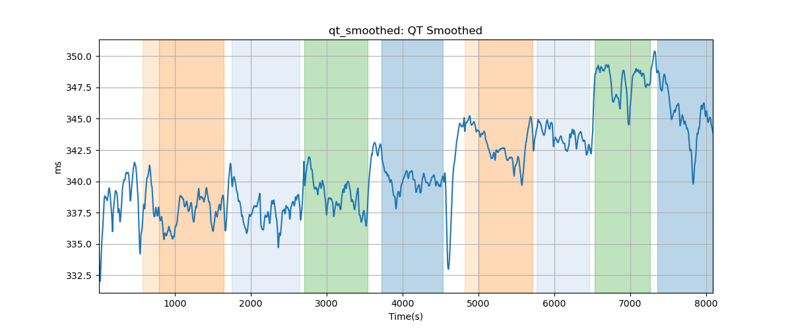

## qt_c: QTc
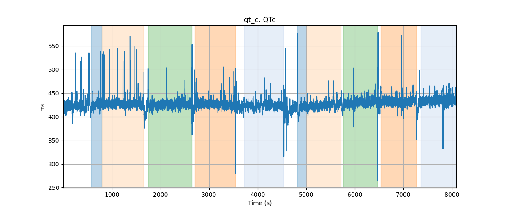

## qt_c_refined: QTc Refined
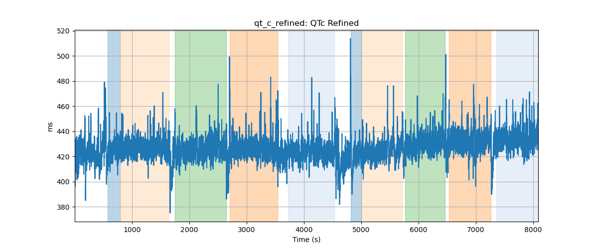

## qt_c_smoothed: QTc Smoothed
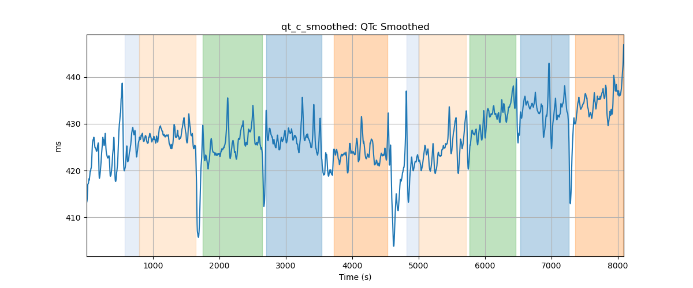

## qrs: QRS Duration (ms)
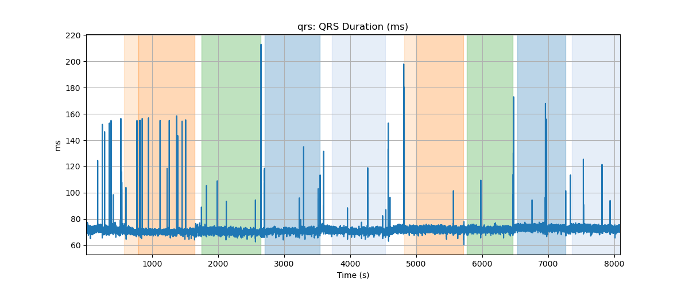

## qrs_refined: QRS Duration Refined (ms)

## qrs_smoothed: QRS Duration Smoothed (ms)
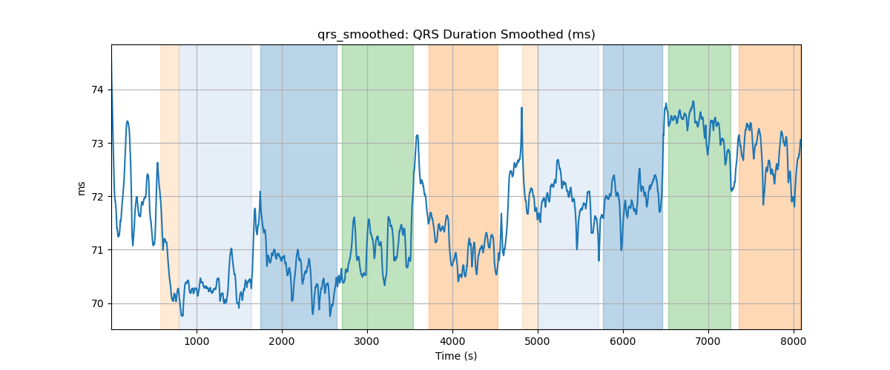

## t_to_r: T/R Ratio
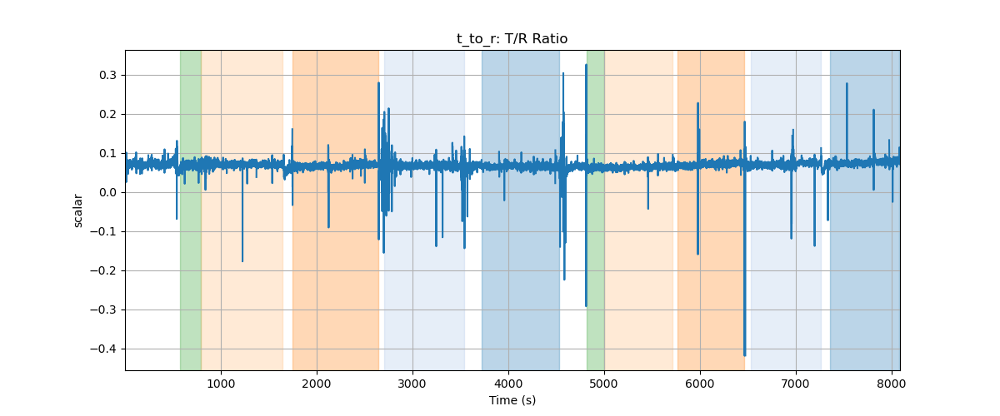

## t_to_r_refined: T/R Refined
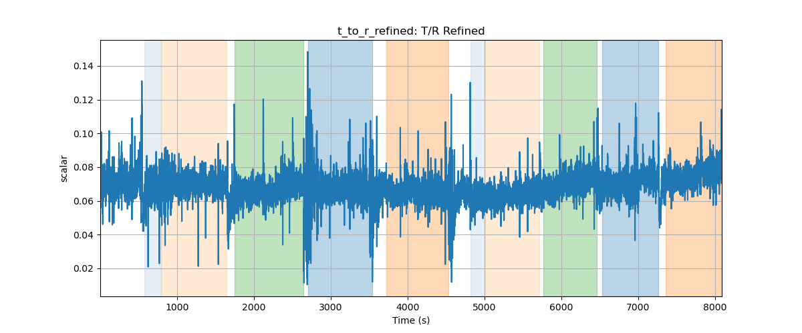

## t_to_r_smoothed: T/R Smoothed
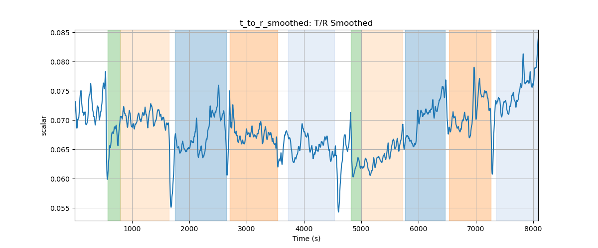
