# Subject S012 PPG Data Processing Summary
Generated on 2024-08-30 16:32:27

## ppg_onset_to_systolic_peak: PPG Onset to Systolic Peak Interval

## ppg_onset_to_dicrotic_notch: PPG Onset to Dicrotic Notch Interval
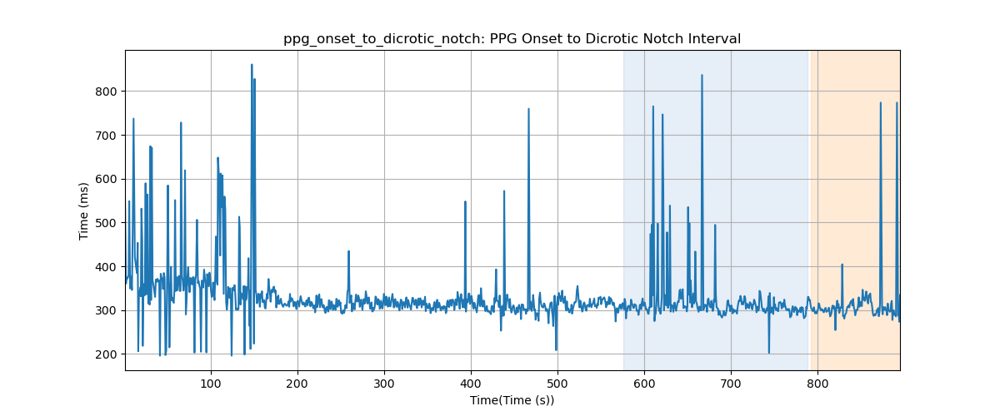

## ppg_onset_to_diastolic_peak: PPG Onset to Diastolic Peak Interval
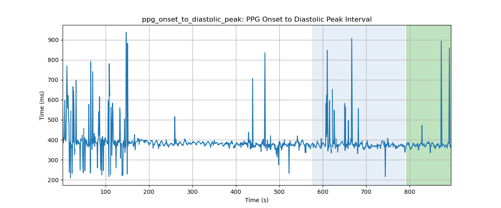

## ppg_onset_to_offset: PPG Onset to PPG Offset Interval
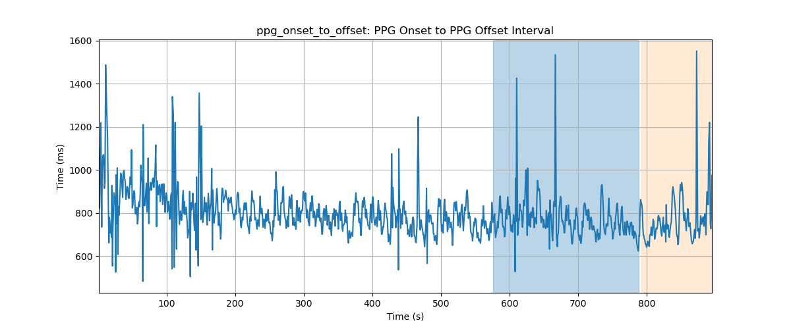

## ppg_onset_to_u_peak: PPG Onset to u Peak Interval
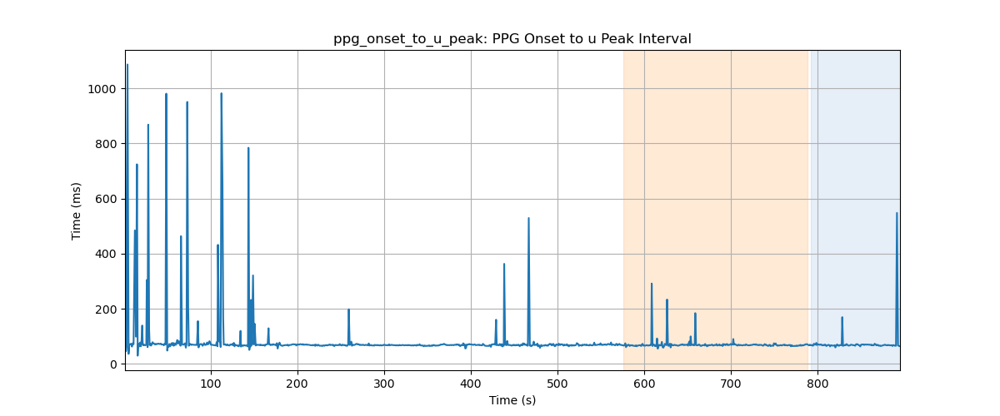

## ppg_onset_to_v_peak: PPG Onset to v Peak Interval
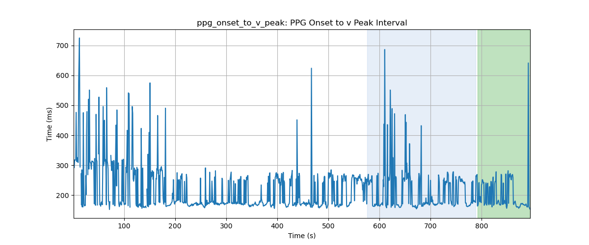

## ppg_onset_to_w_peak: PPG Onset to w Peak Interval
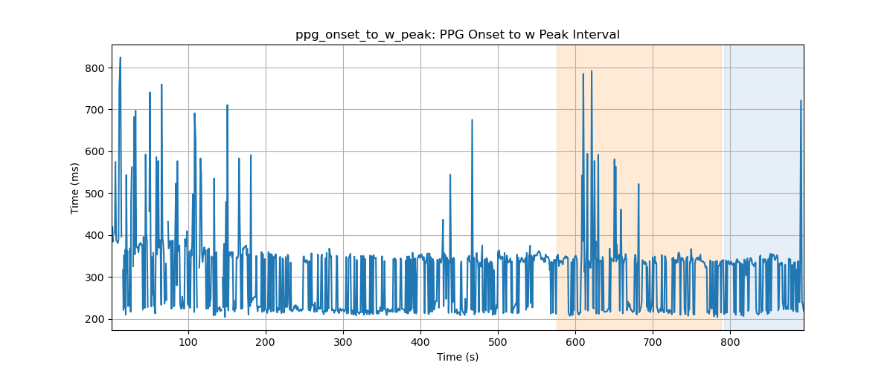

## ppg_onset_to_a_peak: PPG Onset to a Peak Interval
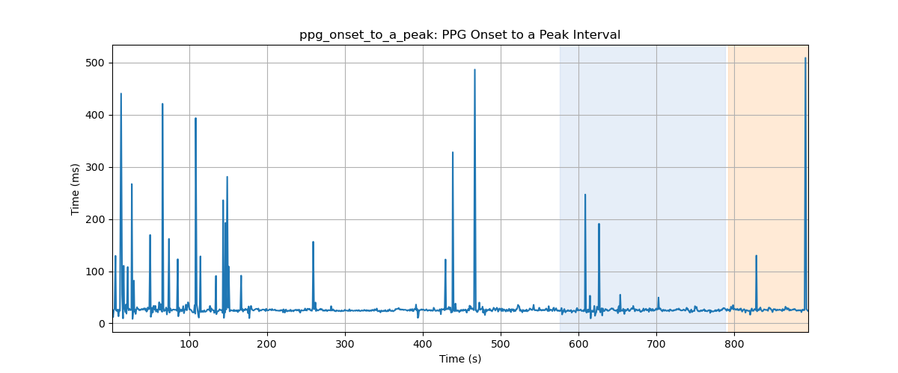

## ppg_onset_to_b_peak: PPG Onset to b Peak Interval
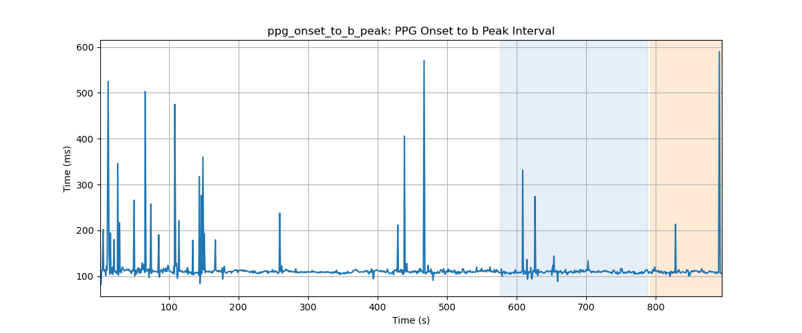

## ppg_onset_to_c_peak: PPG Onset to c Peak Interval
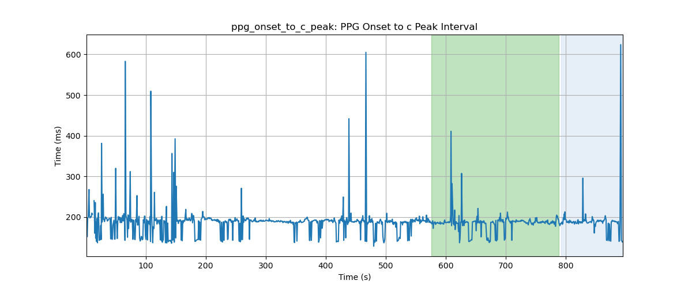

## ppg_onset_to_d_peak: PPG Onset to d Peak Interval
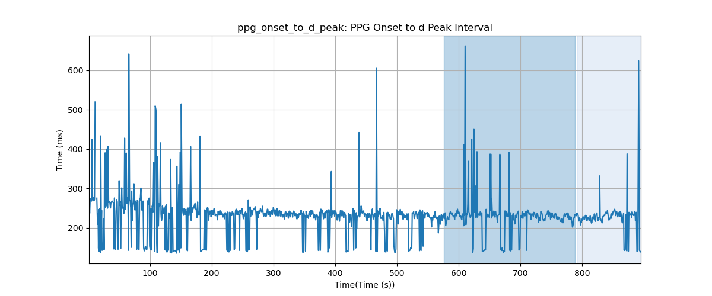

## ppg_onset_to_e_peak: PPG Onset to e Peak Interval
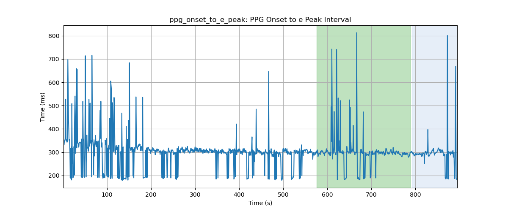

## ppg_onset_to_f_peak: PPG Onset to f Peak Interval
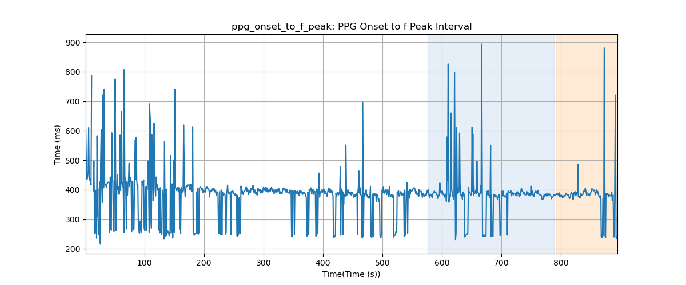

## ppg_onset_to_p1_peak: PPG Onset to p1 Peak Interval
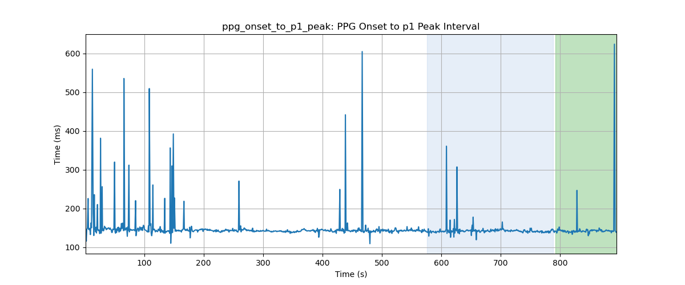

## ppg_onset_to_p2_peak: PPG Onset to p2 Peak Interval
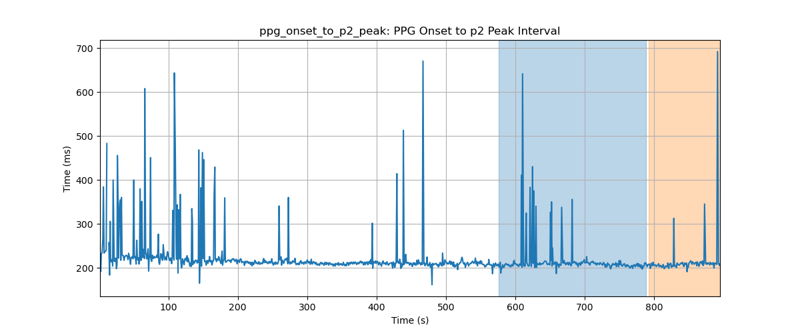
