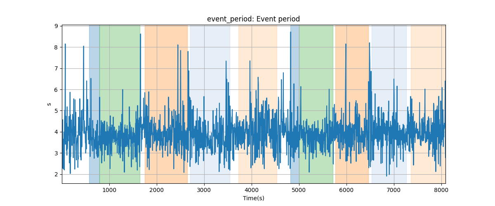
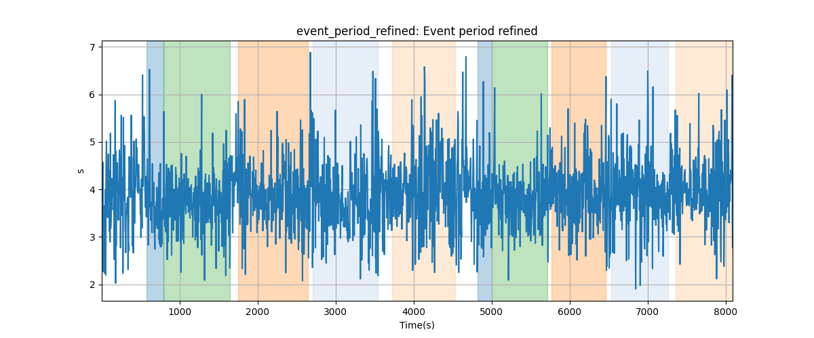
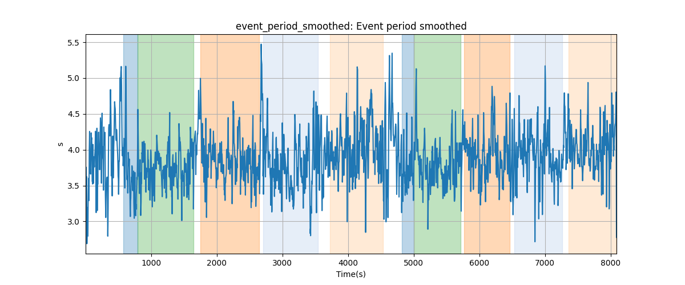
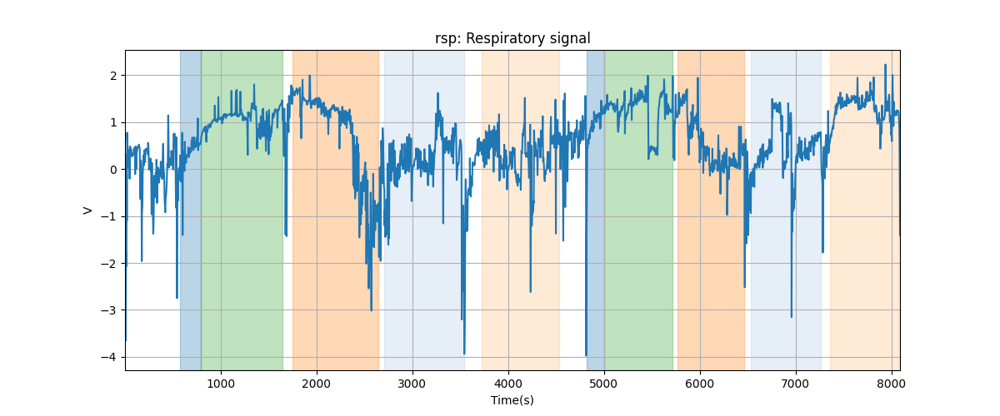
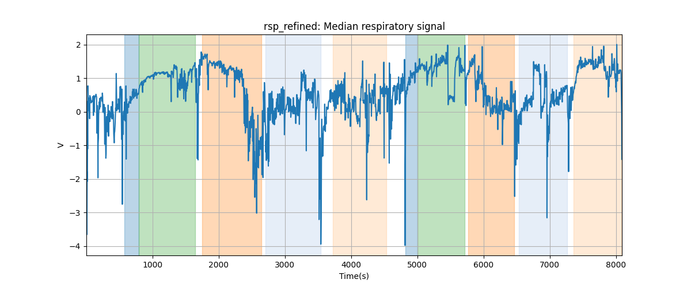
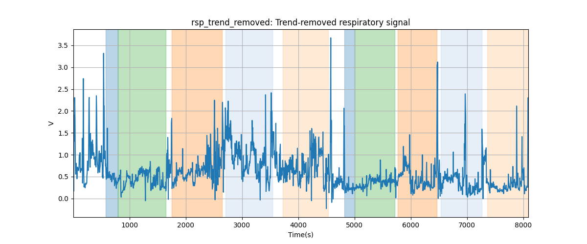
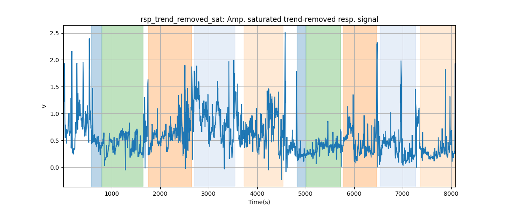

# Subject S012 respiratory data processing summary
Generated on 2024-09-30 20:45:16

## event_period: Event period

## event_period_refined: Event period refined

## event_period_smoothed: Event period smoothed

## rsp: Respiratory signal

## rsp_refined: Median respiratory signal

## rsp_smoothed: Smoothed respiratory signal

## rsp_trend_removed: Trend-removed respiratory signal

## rsp_trend_removed_sat: Amp. saturated trend-removed resp. signal

## rsp_normalized: Amp. saturated trend-removed resp. signal normalized

