# Subject S014 ECG Data Processing Summary

---
## Heart Rate

---
## RR Intervals

---
## R-Wave Amplitudes

---
## QT Intervals

---
## Corrected QT (QTc) Intervals

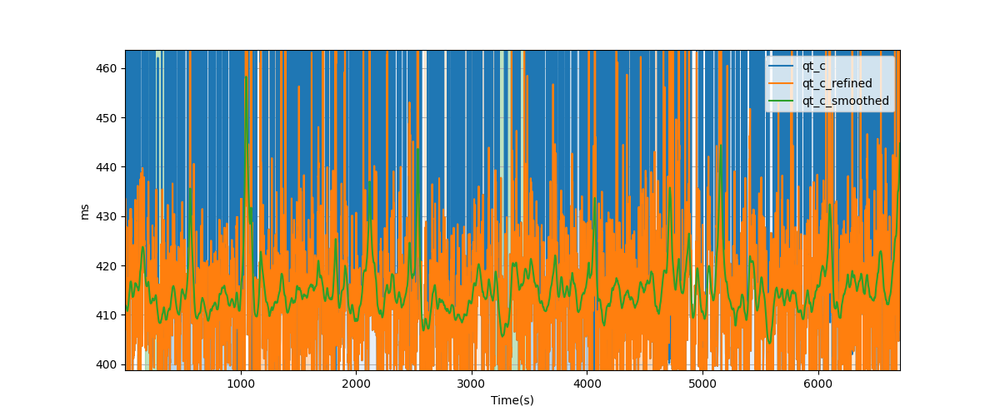

---
## T/R Wave Ratio

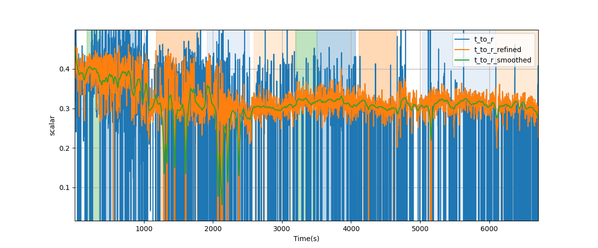

---
# Subject S014 Electrocardiogram Data Processing Detailed

## r_amps: R Amplitudes
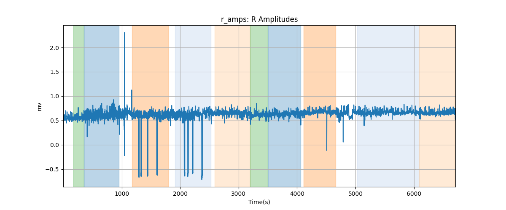

## r_amps_refined: R Amplitudes Refined
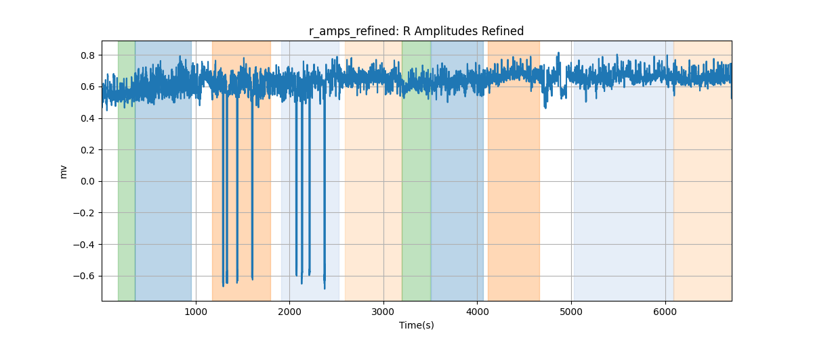

## r_amps_smoothed: R Amplitudes Smoothed
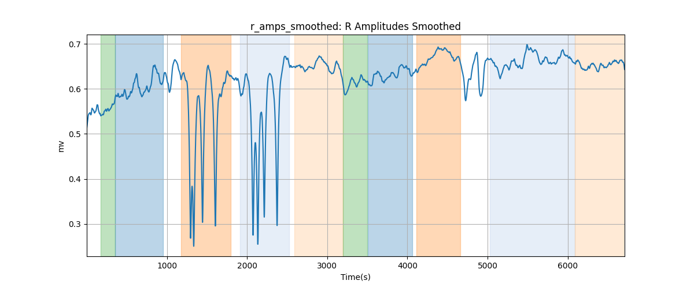

## hr: Heart Rate
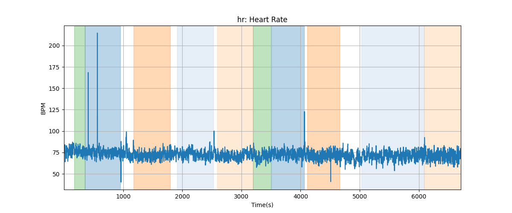

## hr_refined: Heart Rate Refined
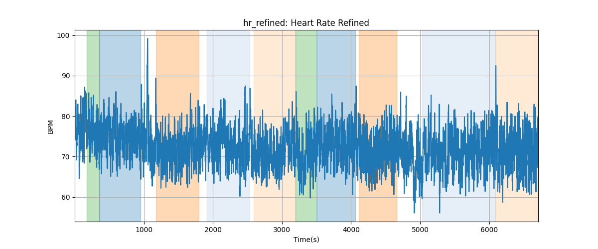

## hr_smoothed: Heart Rate Smoothed
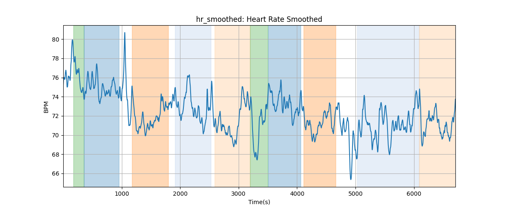

## rr: RR Interval
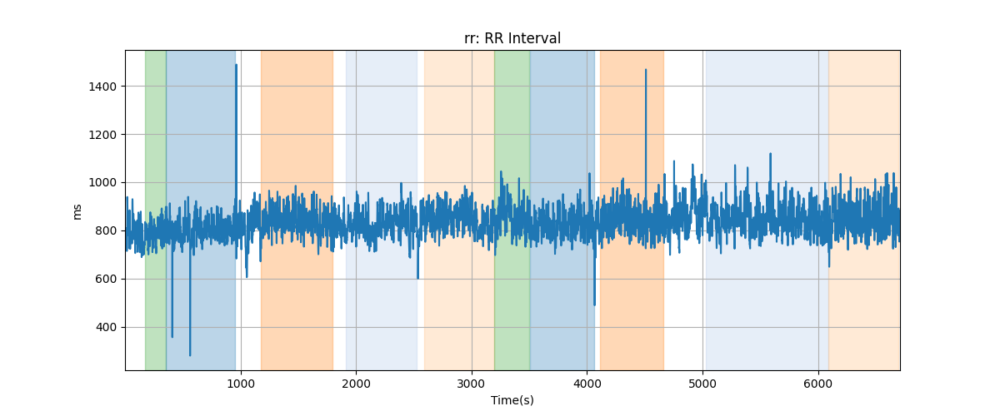

## rr_refined: RR Refined
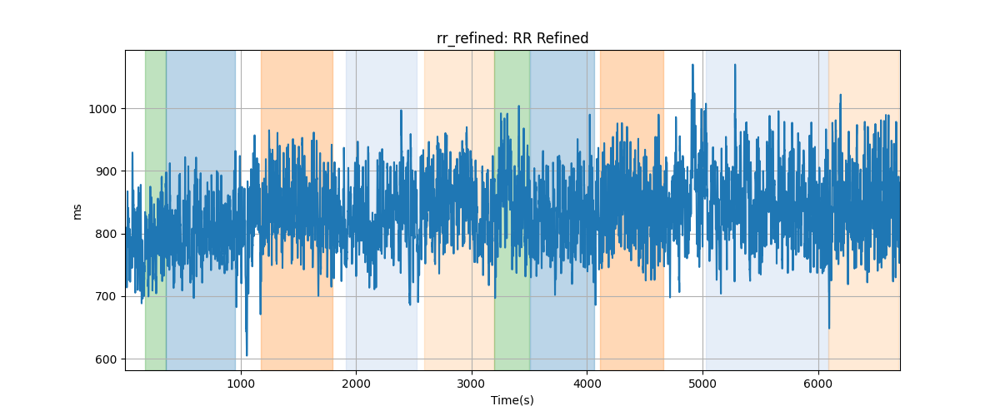

## rr_smoothed: RR Smoothed
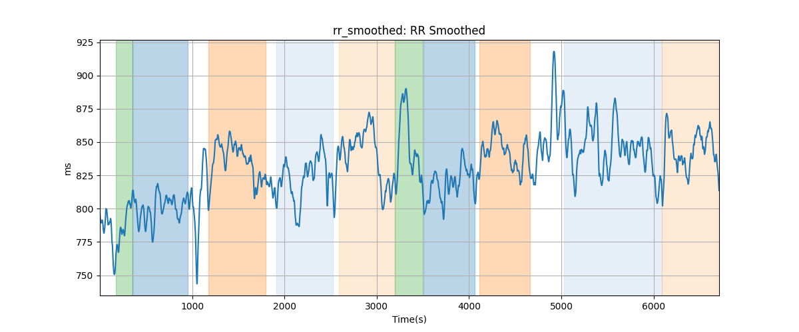

## qt: QT Interval
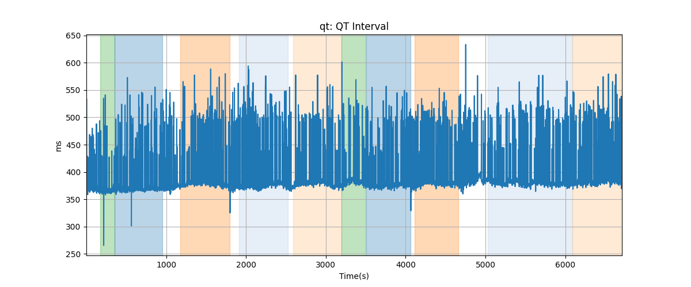

## qt_refined: QT Refined
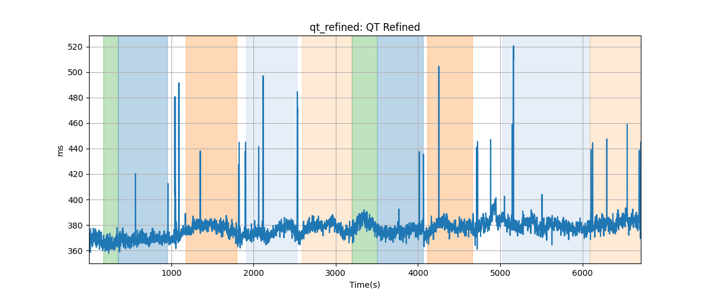

## qt_smoothed: QT Smoothed
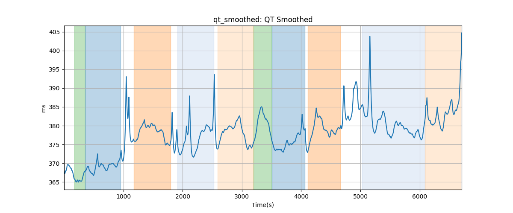

## qt_c: QTc
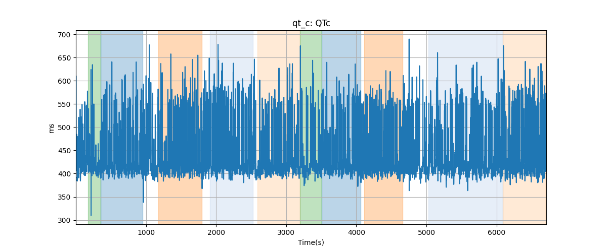

## qt_c_refined: QTc Refined
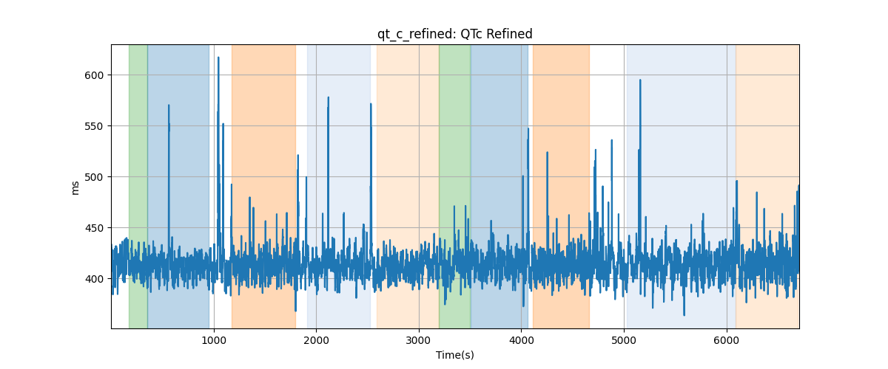

## qt_c_smoothed: QTc Smoothed
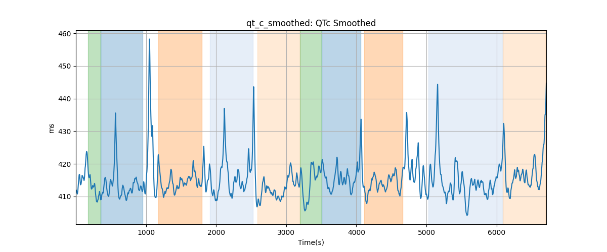

## qrs: QRS Duration
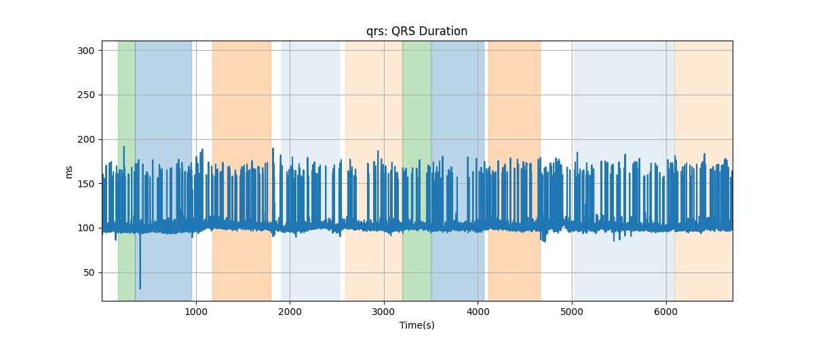

## qrs_refined: QRS Duration Refined
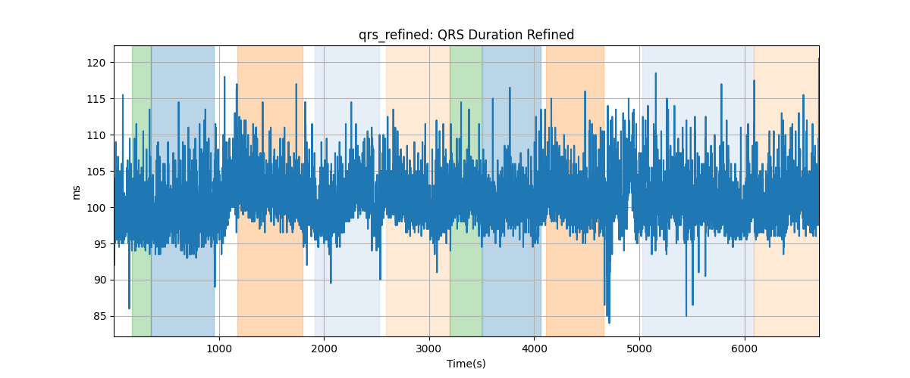

## qrs_smoothed: QRS Duration Smoothed
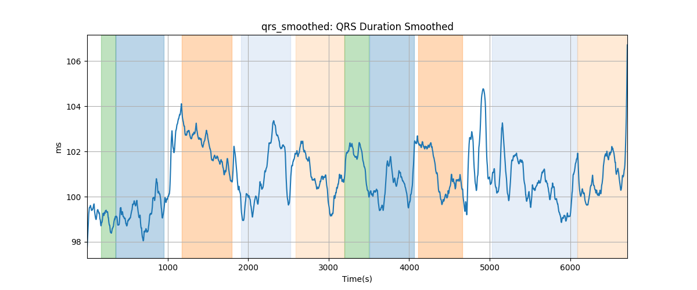

## t_to_r: T/R Ratio

## t_to_r_refined: T/R Refined

## t_to_r_smoothed: T/R Smoothed
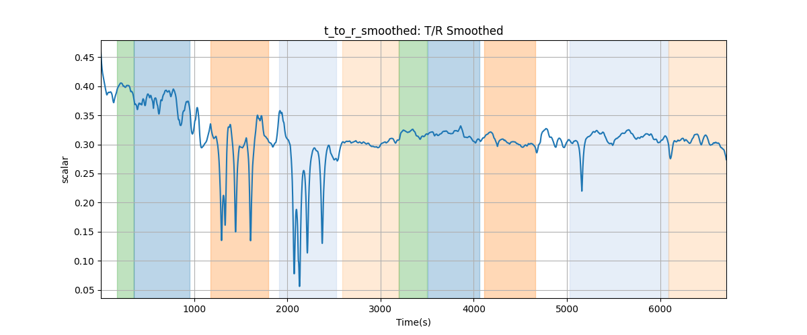
