# Subject S014 morphological ECG features
Generated on 2024-09-15 08:37:46

## S014_ecg_avg_beats_hr_binned

## S014_ecg_med_beats_hr_binned

## S014_ecg_hr_hist

## S014_ecg_beats_stacked

## S014_ecg_norm_beats_stacked

## S014_ecg_stacked_colorcoded_hr

## S014_ecg_beats_waterfall

## S014_ecg_beats_waterfall_logscale

---
## Heart rate

---
## RR intervals

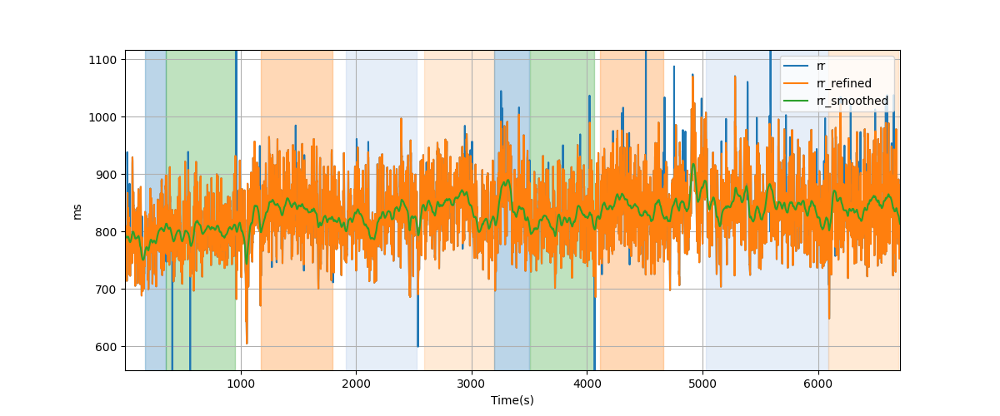

---
## Heart rate variability over sliding windows

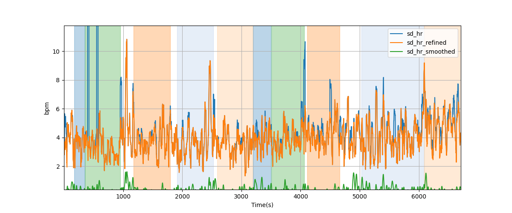

---
## RR-interval variability over sliding windows

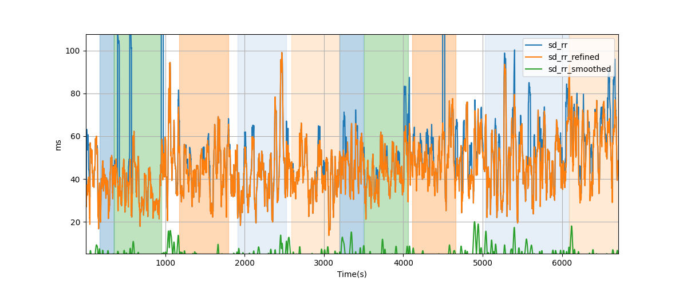

---
## RR-interval difference RMS (RMSSD)

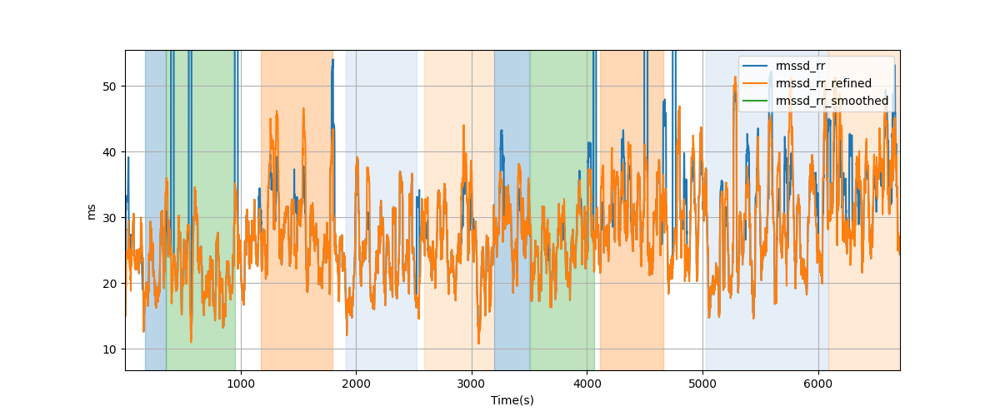

---
## Percentage of successive RR intervals differing by more than 50 ms over 120-beat window

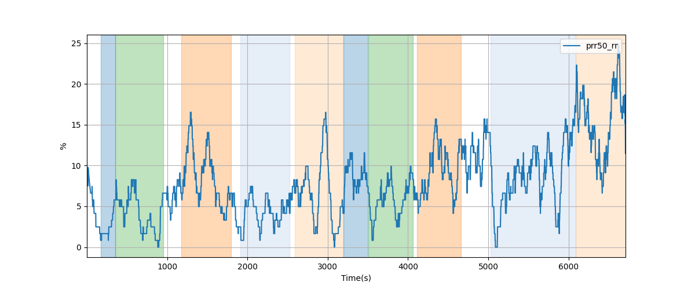

---
## R-wave amplitudes

---
## QT intervals

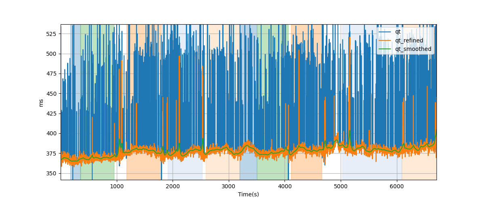

---
## Bazett corrected QT (QTc) intervals

---
## T/R wave ratio

---
# Subject S014 electrocardiogram (ECG) detailed data processing

## hr: Heart-rate
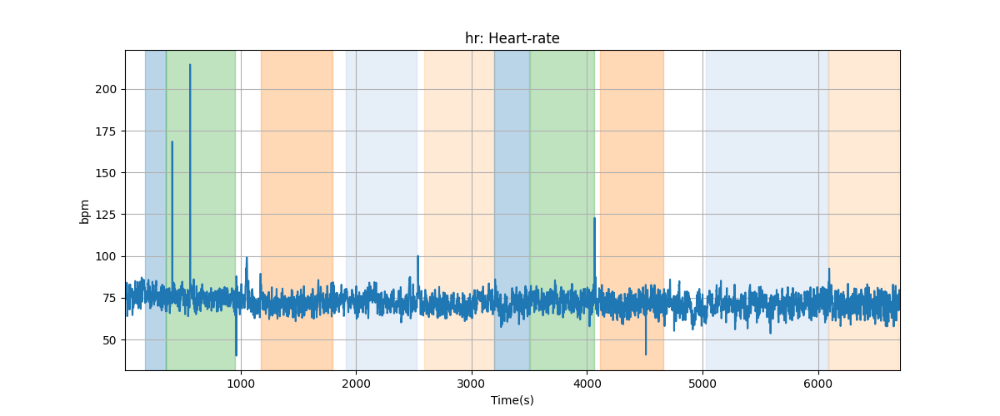

## hr_refined: Heart-rate refined
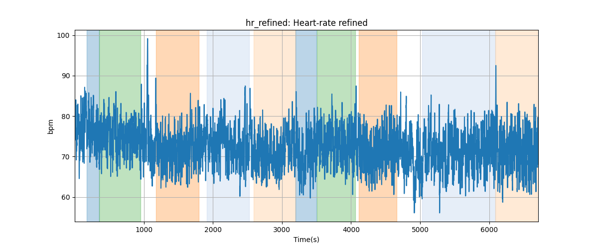

## hr_smoothed: Heart-rate smoothed
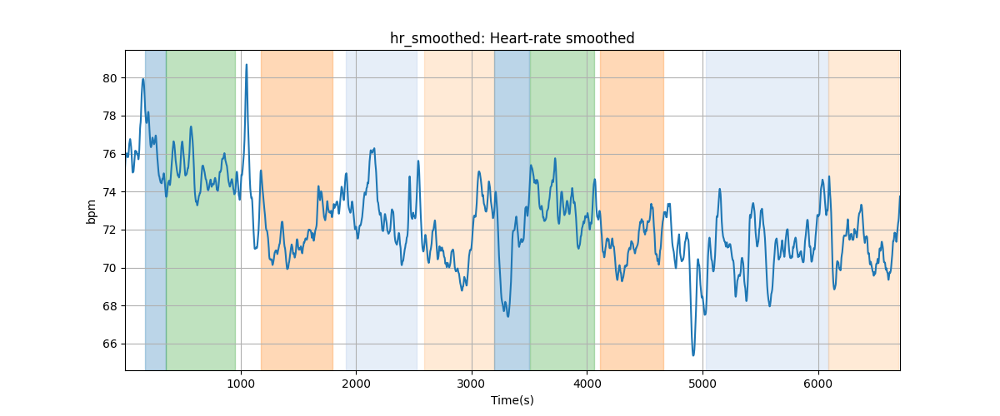

## rr: RR-interval
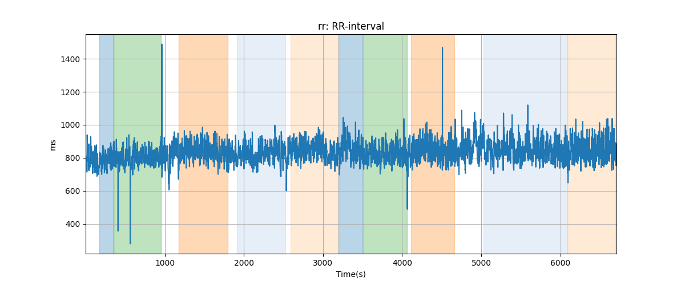

## rr_refined: RR-interval refined

## rr_smoothed: RR-interval smoothed
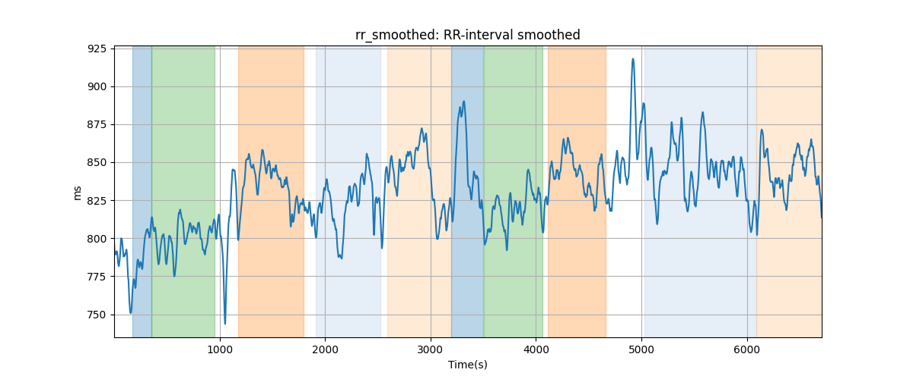

## sd_hr: Heart rate moving STD
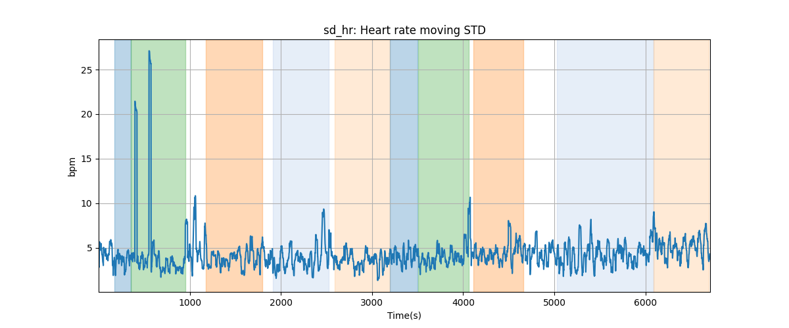

## sd_hr_refined: Refined heart rate moving STD

## sd_hr_smoothed: Smoothed heart rate moving STD
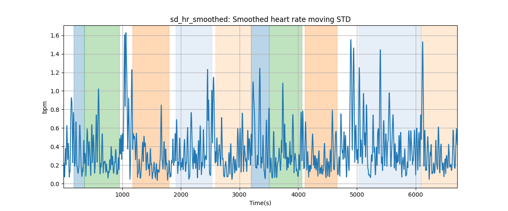

## sd_rr: RR-interval moving STD

## sd_rr_refined: Refined RR-interval moving STD
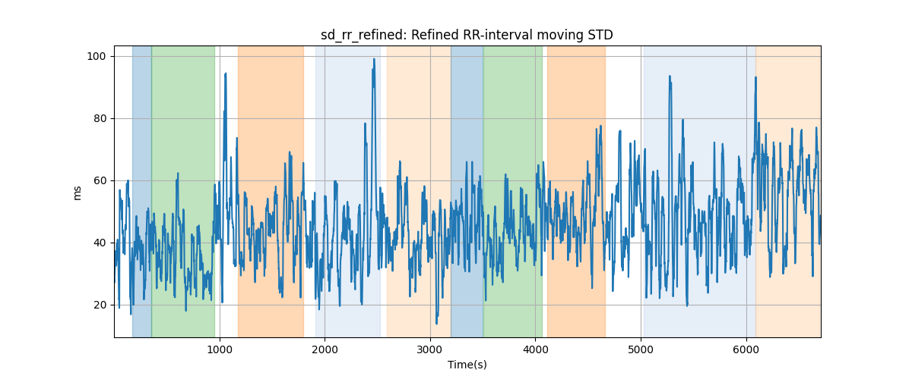

## sd_rr_smoothed: Smoothed RR-interval moving STD

## rmssd_rr: RR-interval diff RMS

## rmssd_rr_refined: Refined RR-interval diff RMS

## rmssd_rr_smoothed: Smoothed RR-interval diff RMS
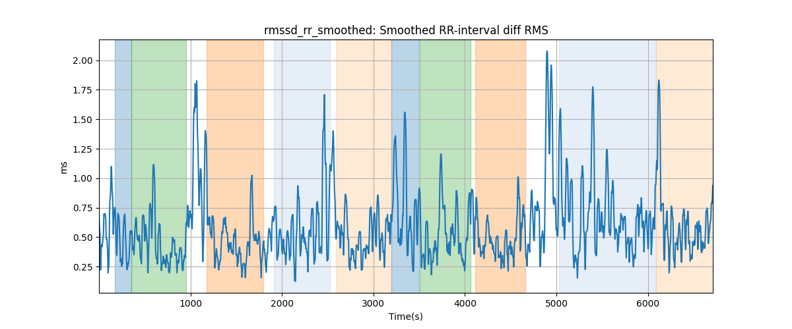

## prr50_rr: RR-interval PRR50ms

## r_amps: R-wave amplitudes
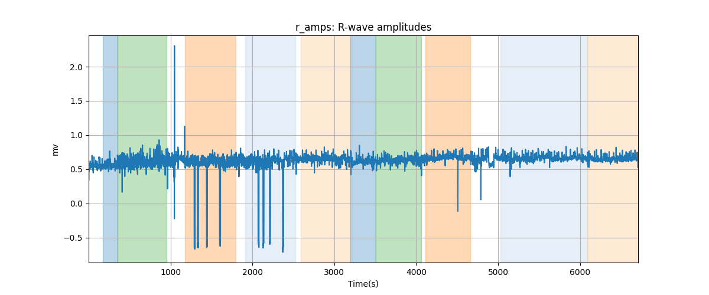

## r_amps_refined: R-wave amplitudes refined
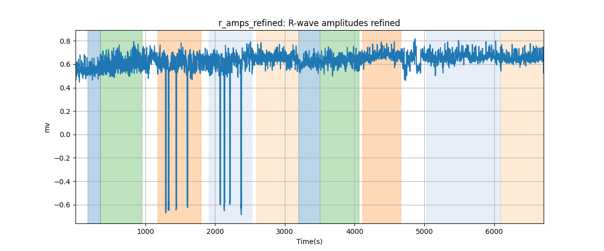

## r_amps_smoothed: R-wave amplitudes smoothed

## qt: QT-interval

## qt_refined: QT-interval refined
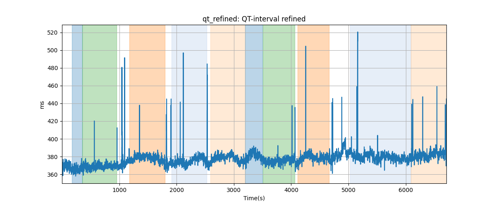

## qt_smoothed: QT-interval smoothed
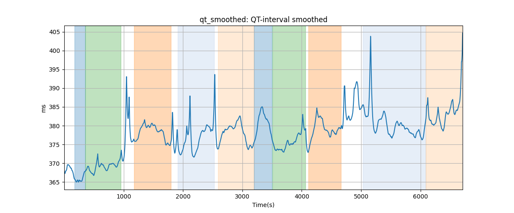

## qt_c: QTc (Bazett)

## qt_c_refined: QTc (Bazett) refined
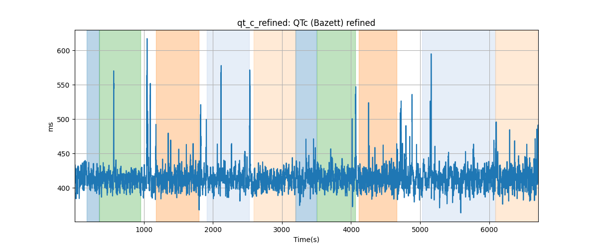

## qt_c_smoothed: QTc (Bazett) smoothed
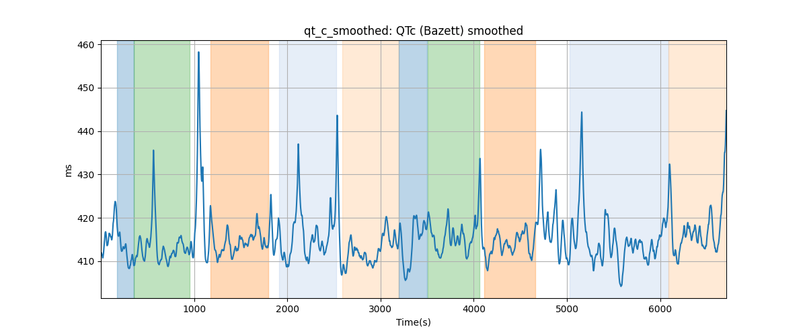

## qrs: QRS duration
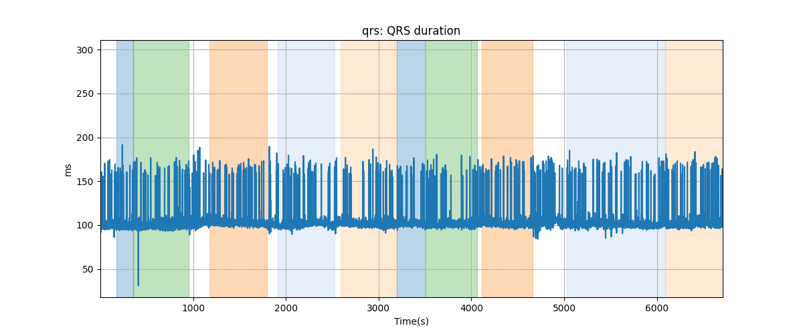

## qrs_refined: QRS duration refined
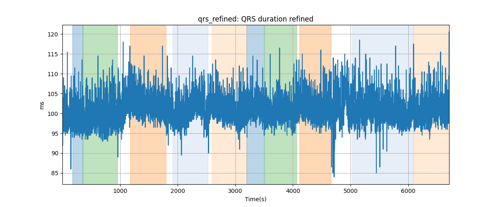

## qrs_smoothed: QRS duration smoothed

## t_to_r: T/R ratio

## t_to_r_refined: T/R ratio refined

## t_to_r_smoothed: T/R ratio smoothed
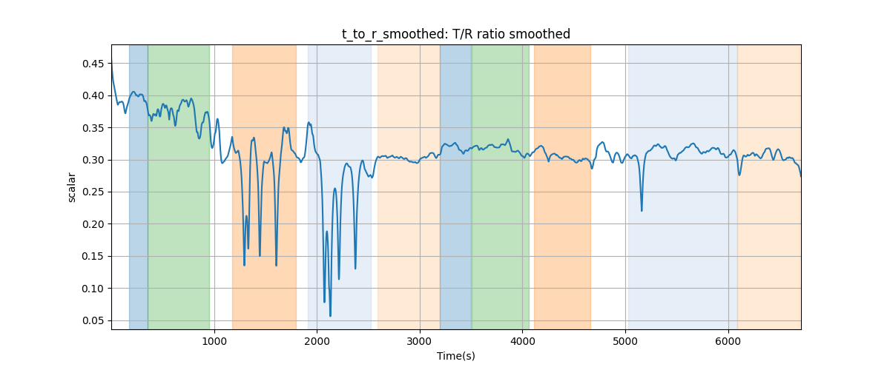
