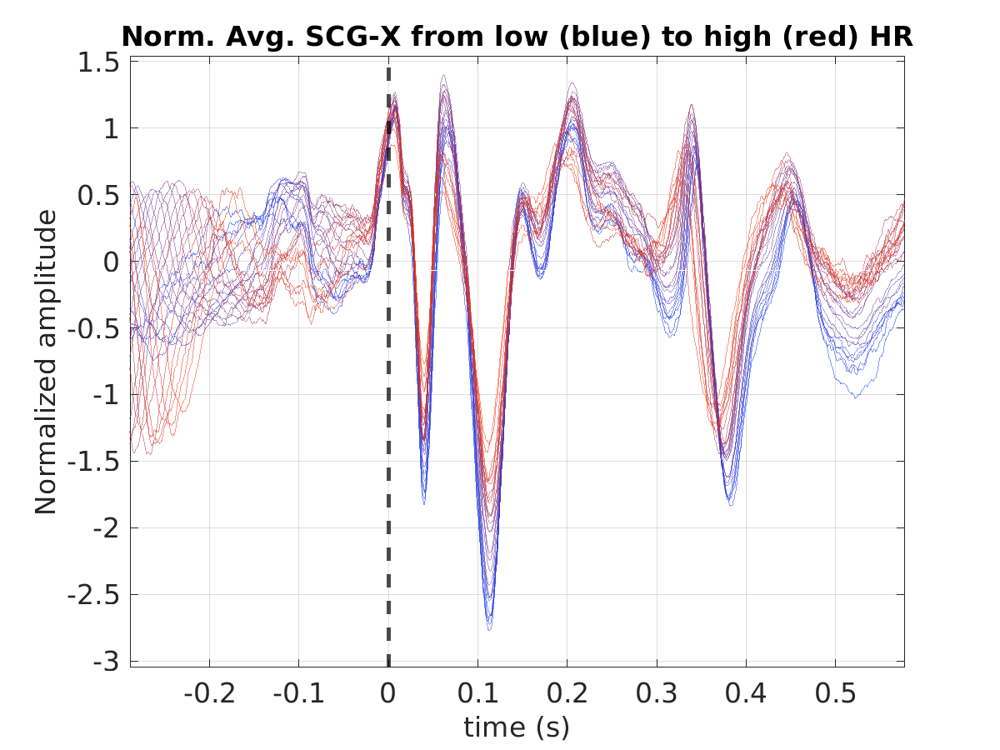
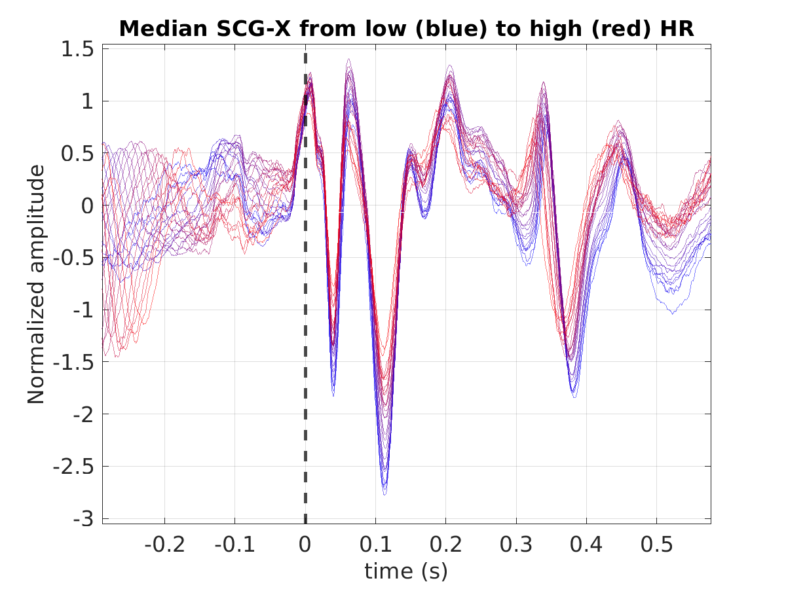
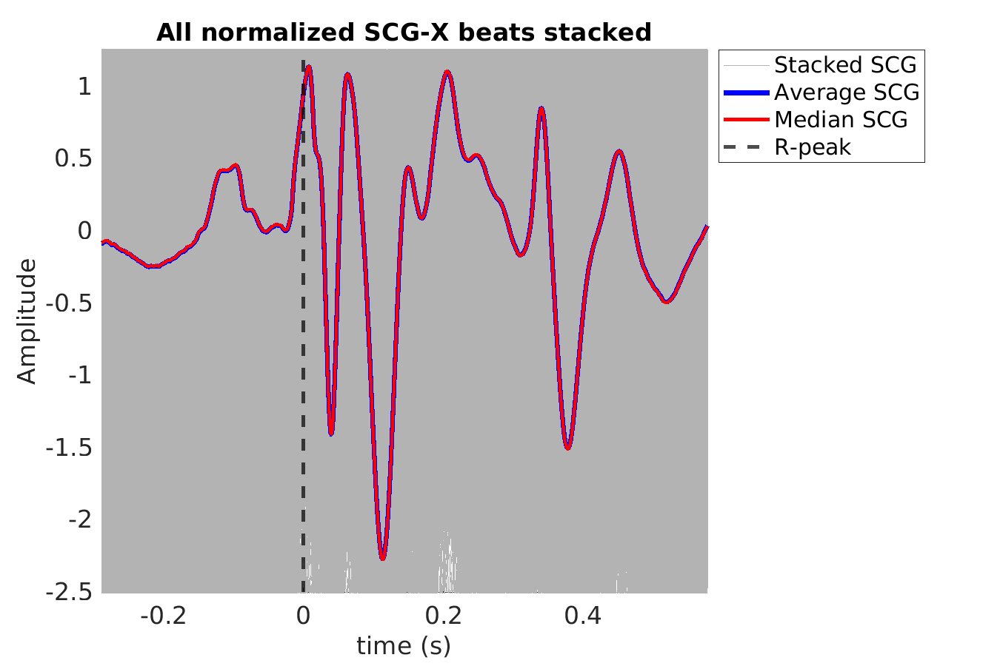
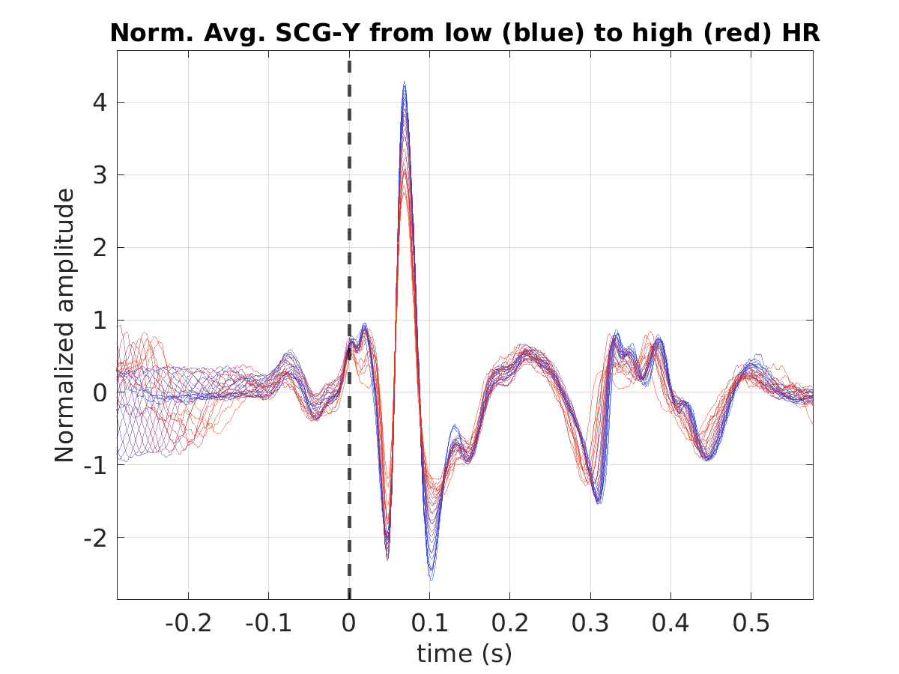
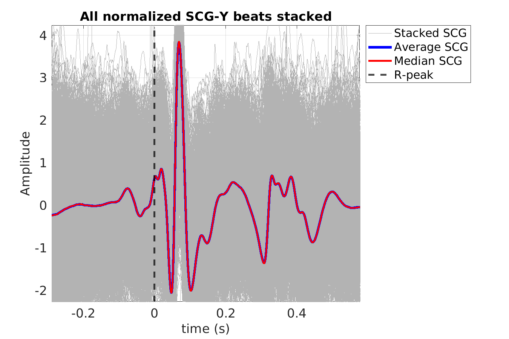
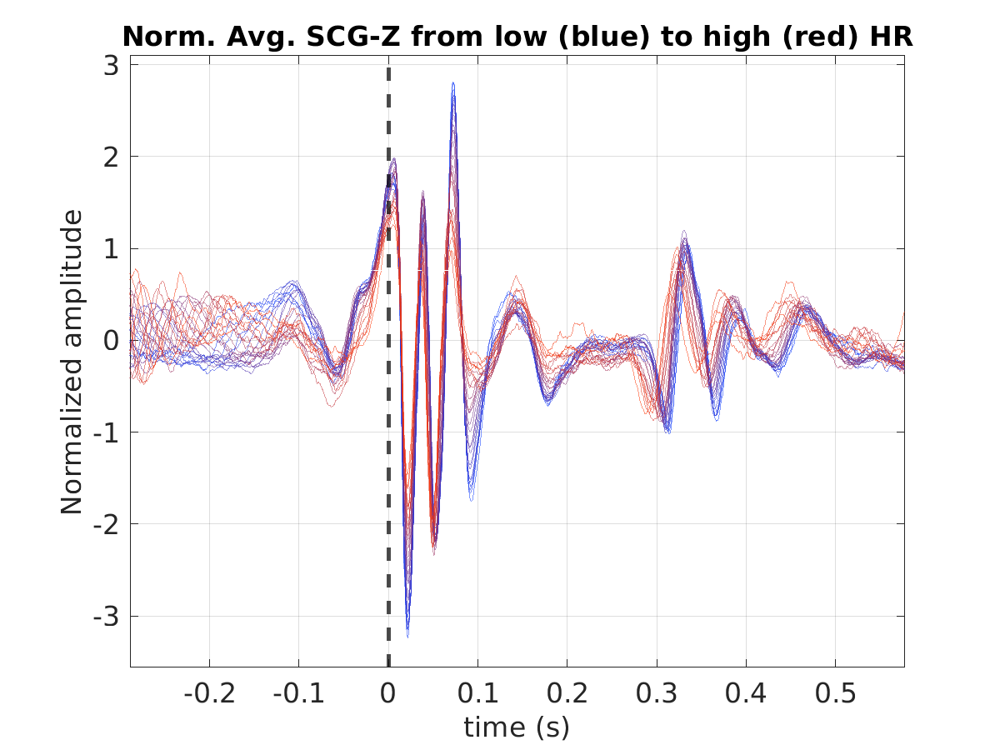
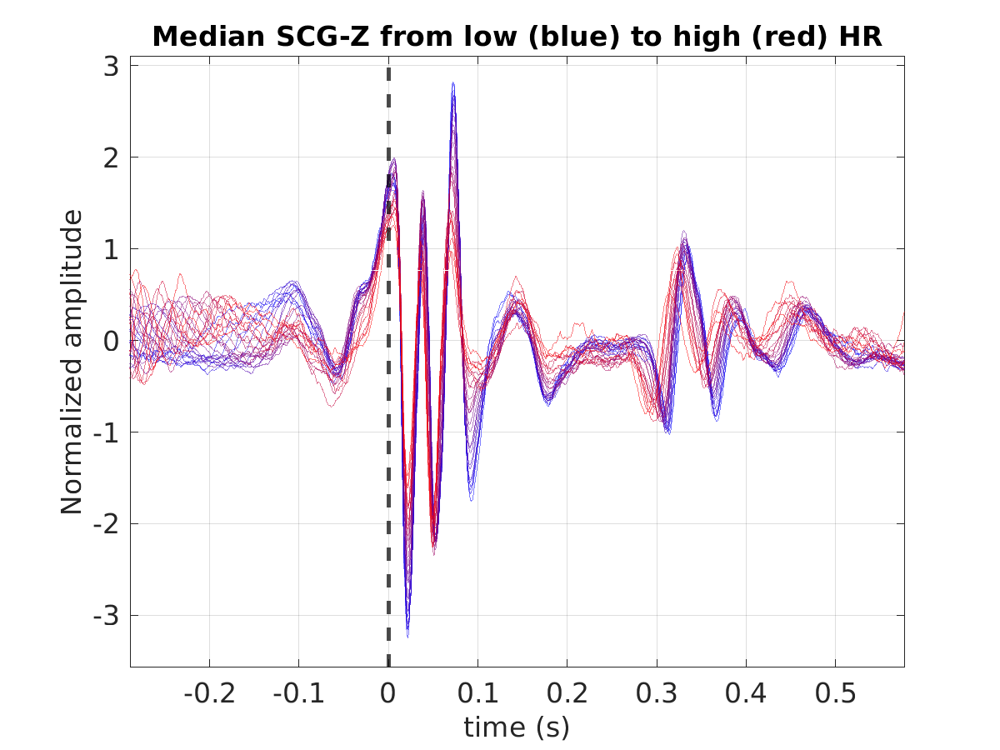
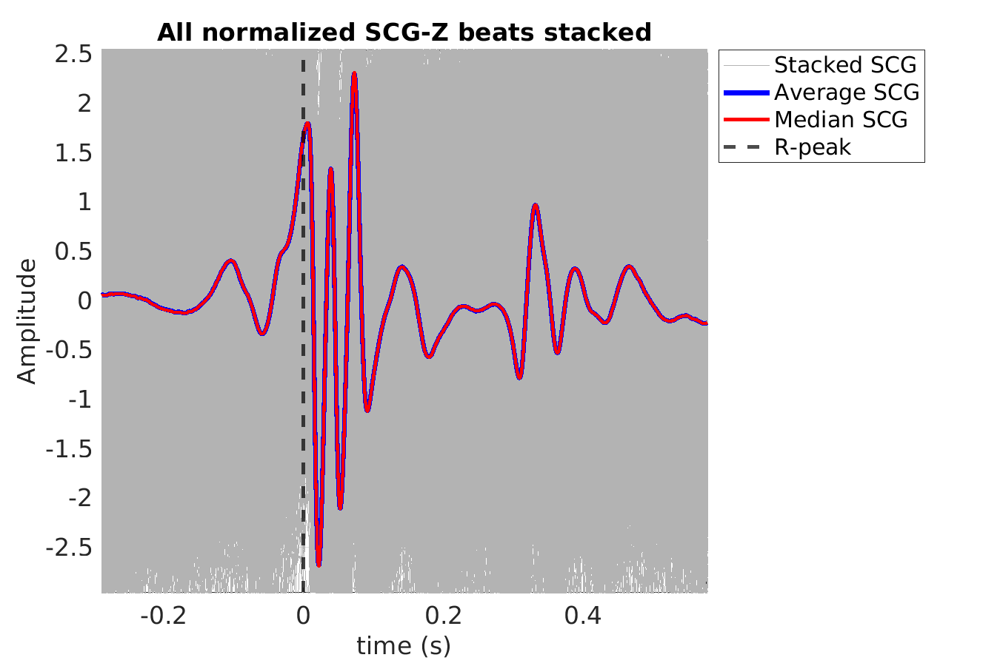
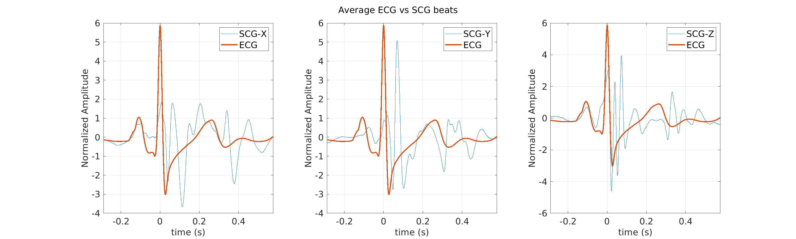
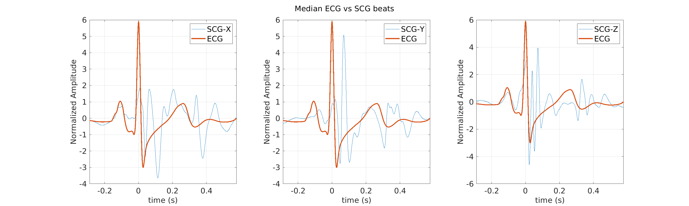

# Subject S021 seismocardiogram (SCG) data processing summary
Generated on 2024-09-15 08:51:10

## S021_scg_avg_scgx_hr_binned_norm

## S021_scg_med_scgx_hr_binned_norm

## S021_scg_scgx_stacked_norm

## S021_scg_avg_scgy_hr_binned_norm

## S021_scg_med_scgy_hr_binned_norm

## S021_scg_scgy_stacked_norm

## S021_scg_avg_scgz_hr_binned_norm

## S021_scg_med_scgz_hr_binned_norm

## S021_scg_scgz_stacked_norm

## S021_scg_avg_ecg_scg

## S021_scg_med_ecg_scg

