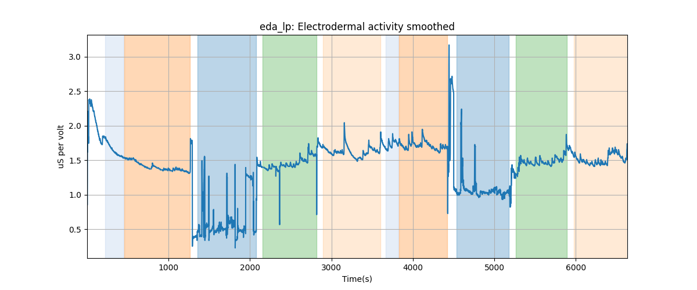

# Subject S024 Electrodermal activity data processing summary
Generated on 2024-09-15 08:56:41

## eda: Electrodermal activity

## eda_lp: Electrodermal activity smoothed

---
# EDA segment falling/rising wave amplitudes

---
# EDA segment falling/rising wave durations

---
# EDA segment falling/rising wave average amplitudes

---
# EDA segment falling/rising wave median amplitudes

