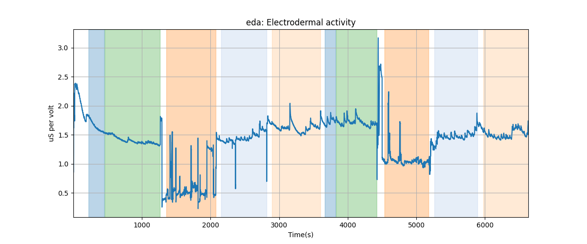
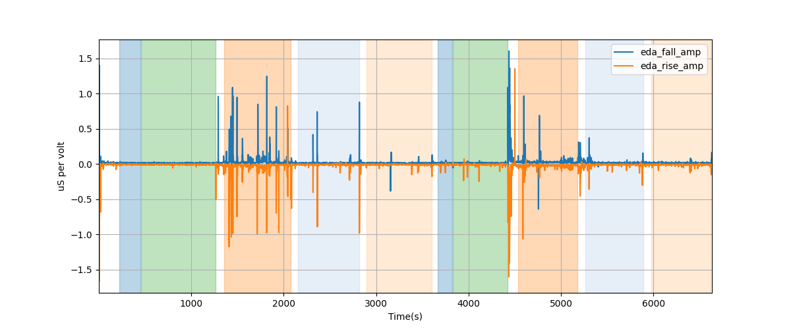
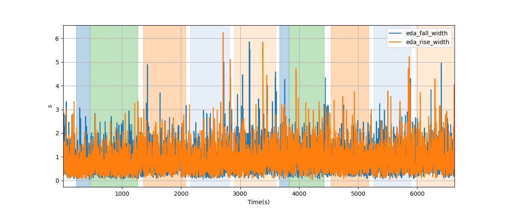
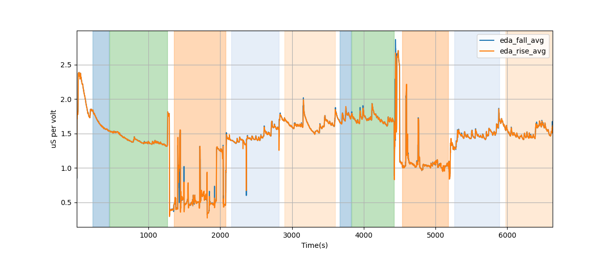

# Subject S024 Electrodermal Activity Data Processing Summary
Generated on 2024-09-09 18:12:29

## eda: Electrodermal Activity

---
# EDA exp model falling peak amplitude

---
# EDA exp model rising peak amplitude

---
# EDA model falling exponential decay rate

---
# EDA model rising exponential decay rate

---
# EDA model falling exponential half-life

---
# EDA model rising exponential half-life

