# Subject S027 seismocardiogram (SCG) data processing summary
Generated on 2024-09-15 09:05:10

## S027_scg_avg_scgx_hr_binned_norm
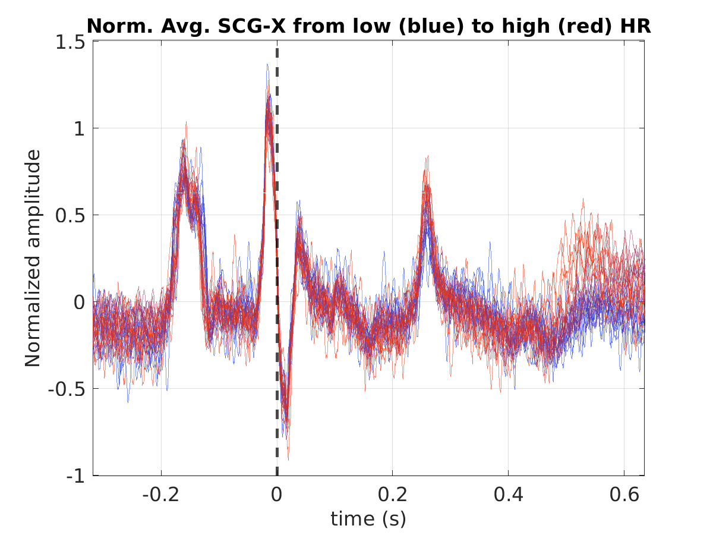

## S027_scg_med_scgx_hr_binned_norm
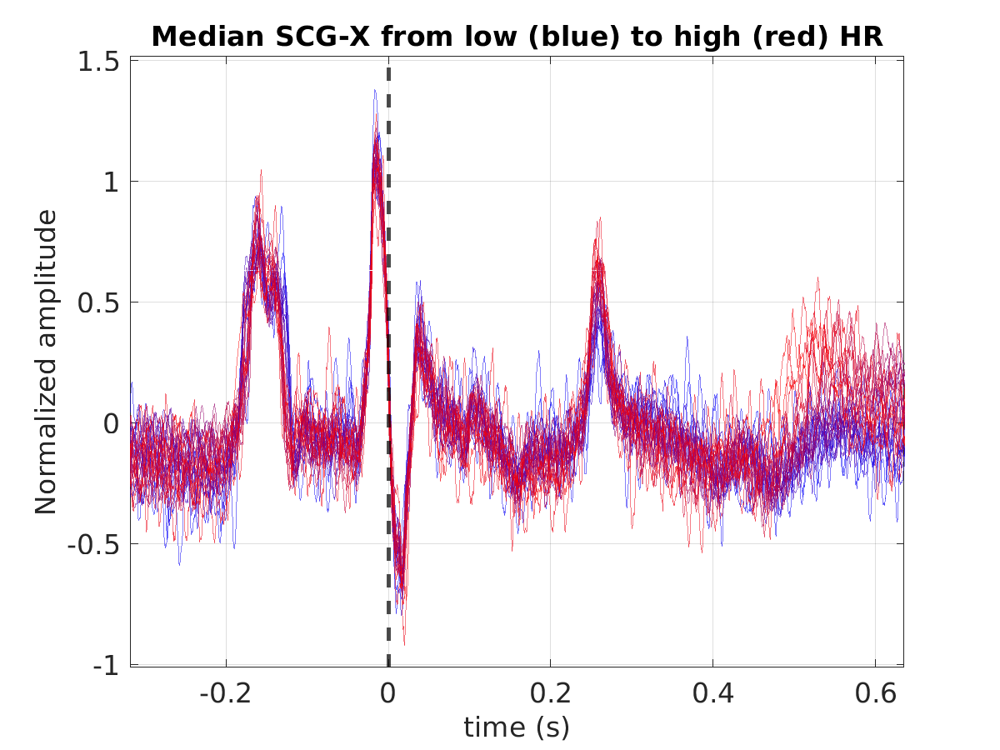

## S027_scg_scgx_stacked_norm
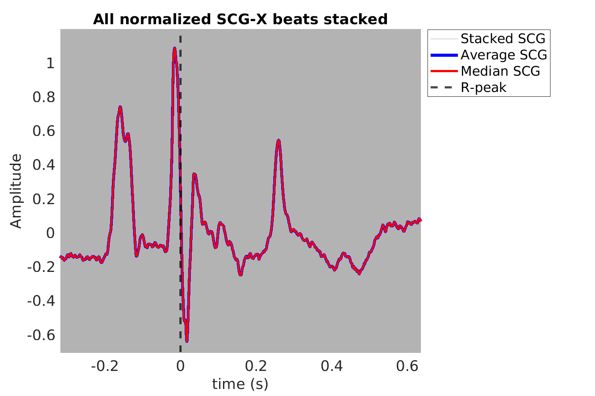

## S027_scg_avg_scgy_hr_binned_norm
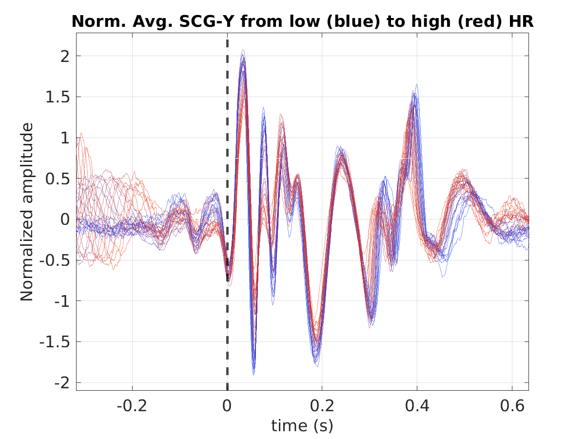

## S027_scg_med_scgy_hr_binned_norm
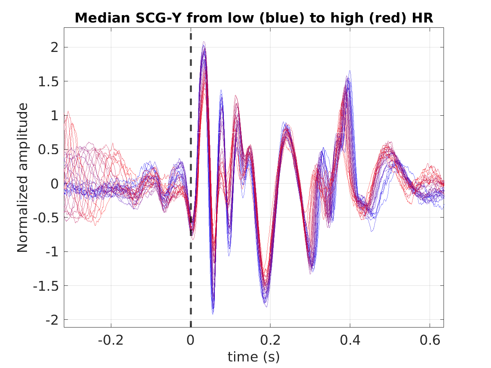

## S027_scg_scgy_stacked_norm
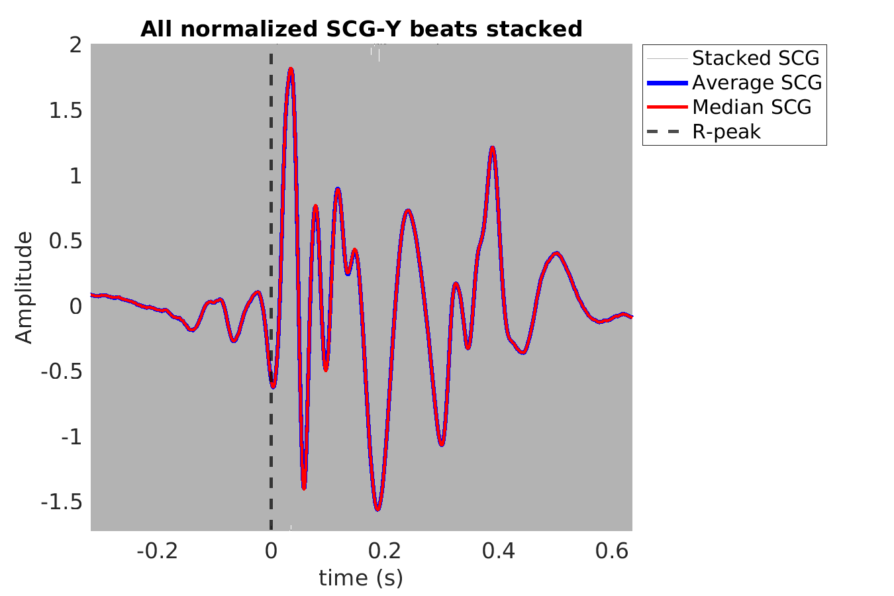

## S027_scg_avg_scgz_hr_binned_norm
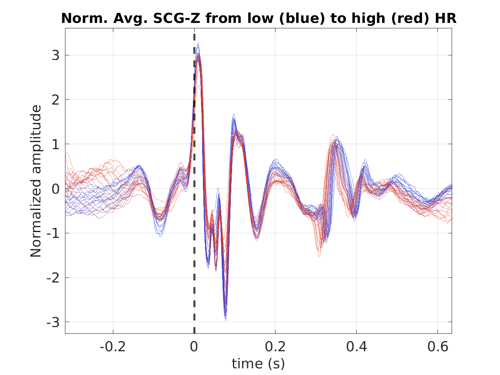

## S027_scg_med_scgz_hr_binned_norm
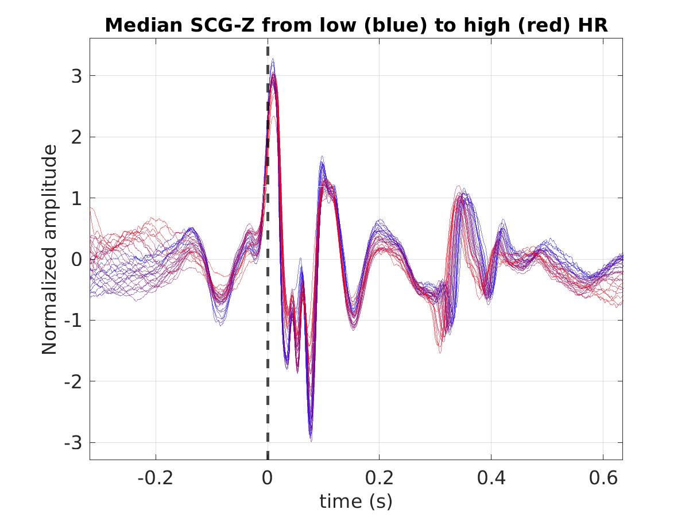

## S027_scg_scgz_stacked_norm
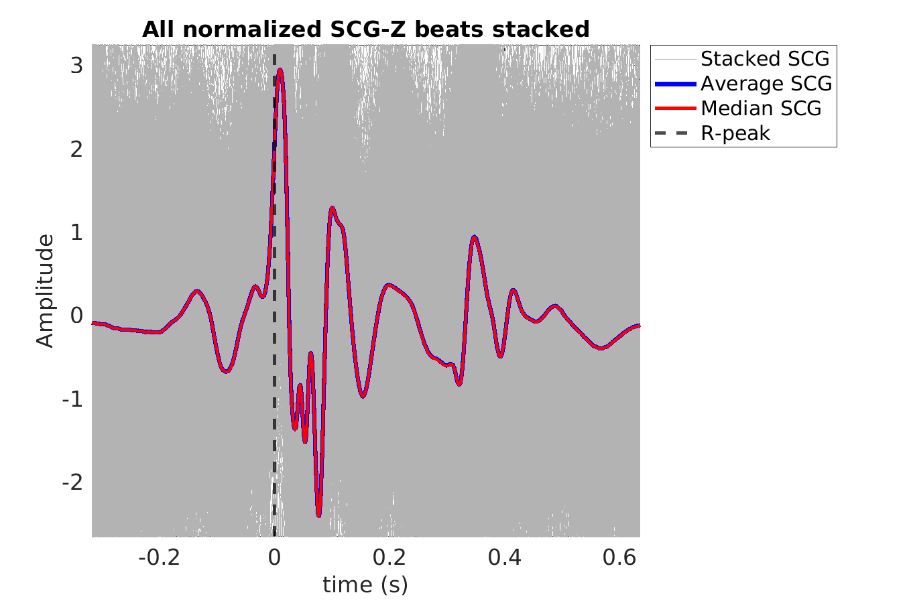

## S027_scg_avg_ecg_scg
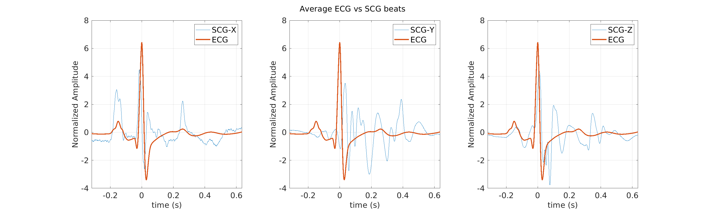

## S027_scg_med_ecg_scg
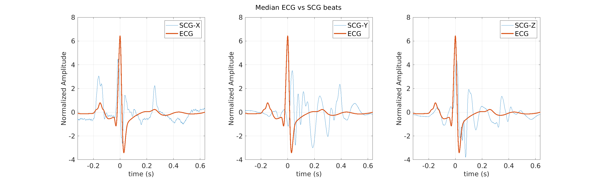
