# Subject S028 seismocardiogram (SCG) data processing summary
Generated on 2024-09-15 09:08:09

## S028_scg_avg_scgx_hr_binned_norm
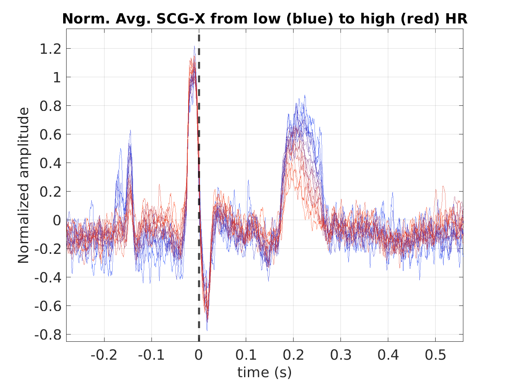

## S028_scg_med_scgx_hr_binned_norm
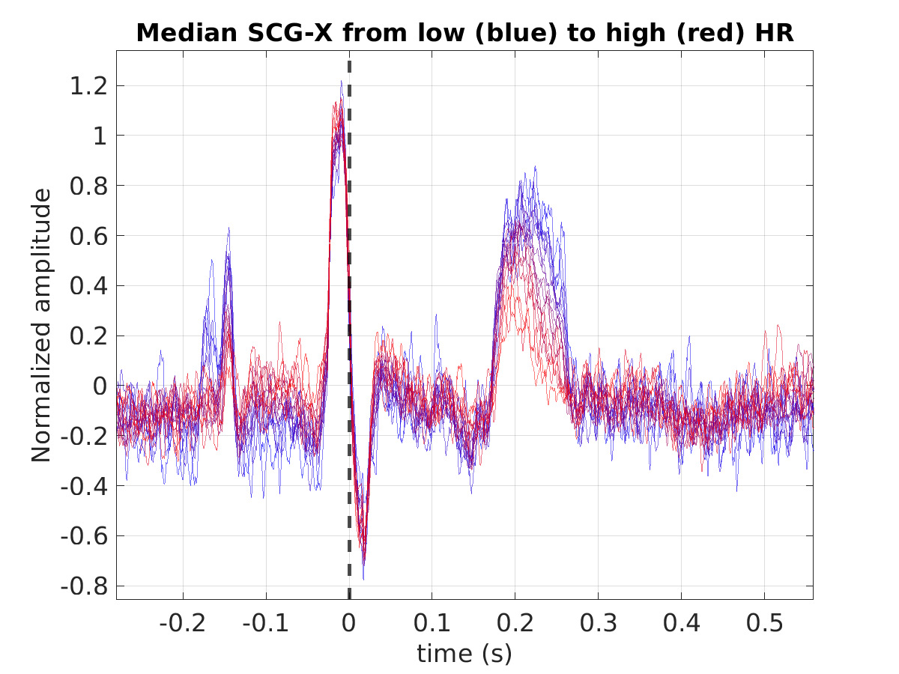

## S028_scg_scgx_stacked_norm
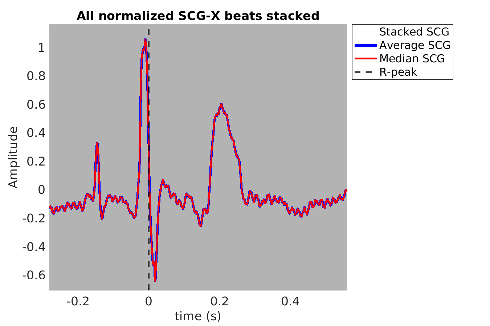

## S028_scg_avg_scgy_hr_binned_norm
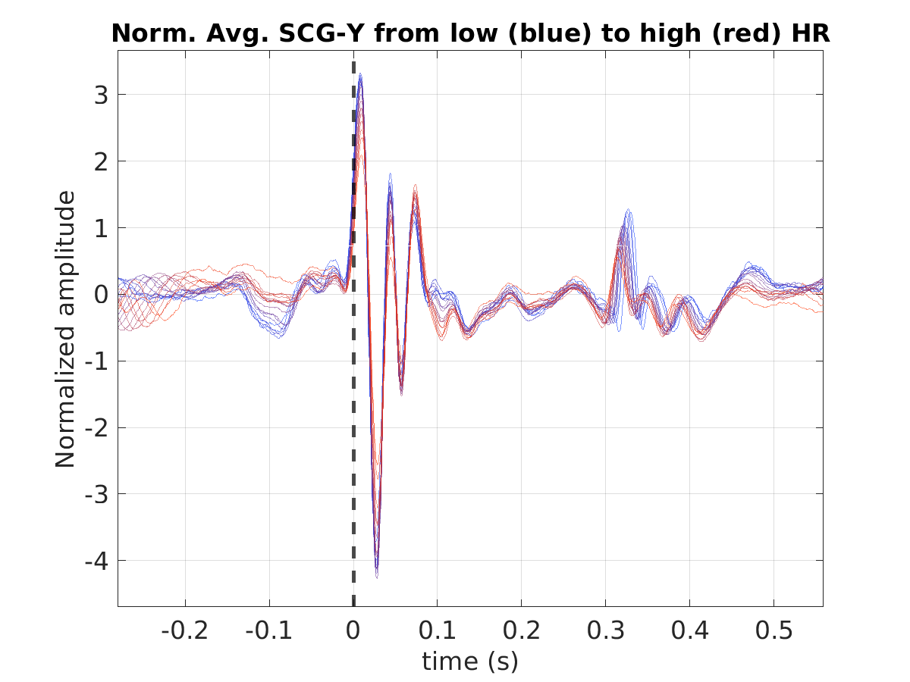

## S028_scg_med_scgy_hr_binned_norm
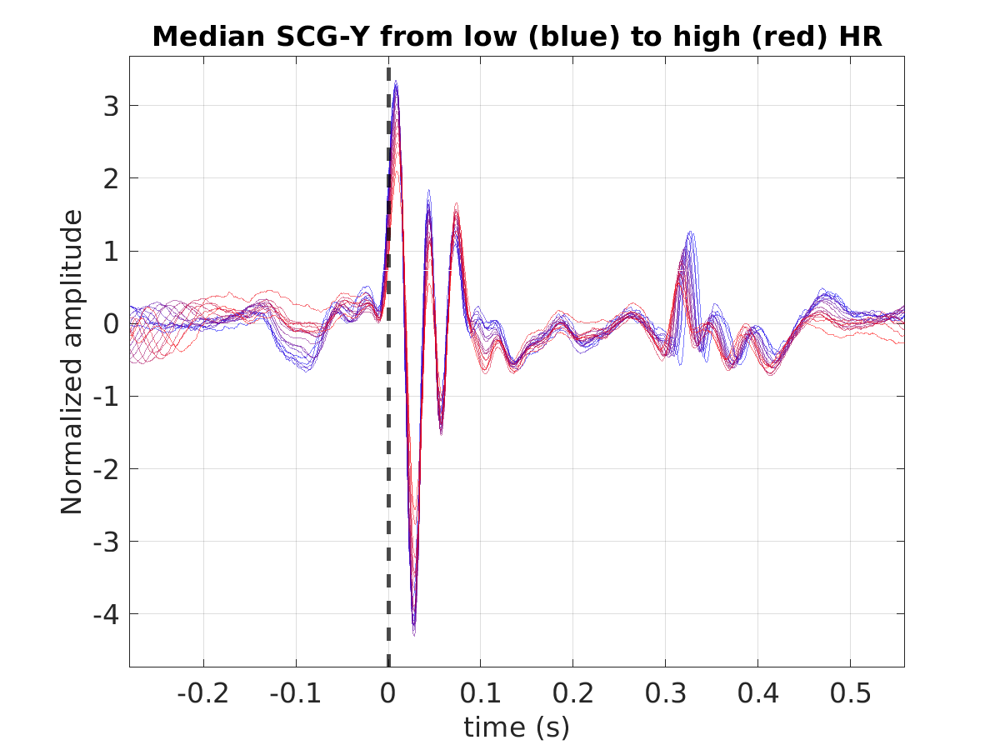

## S028_scg_scgy_stacked_norm
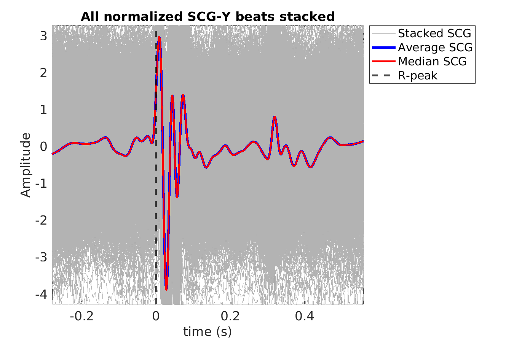

## S028_scg_avg_scgz_hr_binned_norm
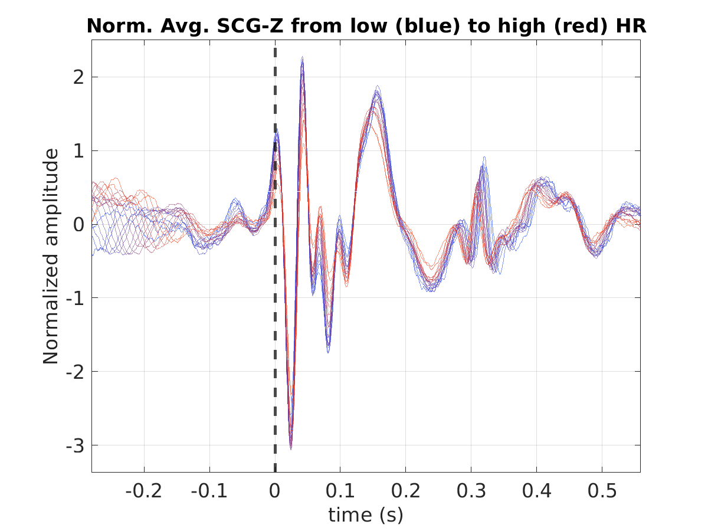

## S028_scg_med_scgz_hr_binned_norm
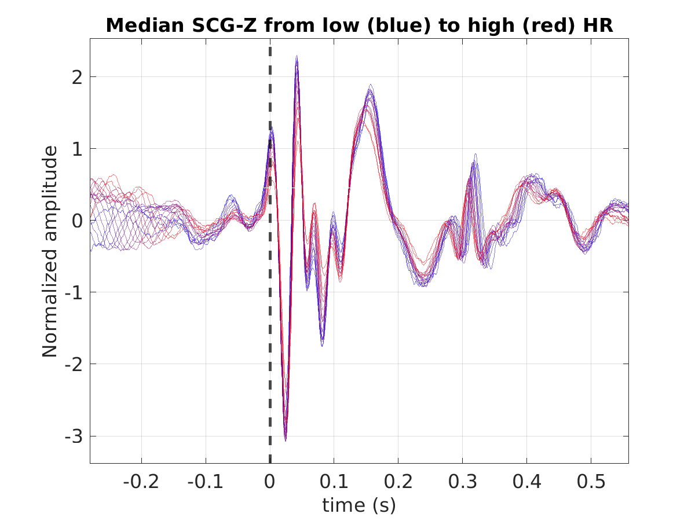

## S028_scg_scgz_stacked_norm
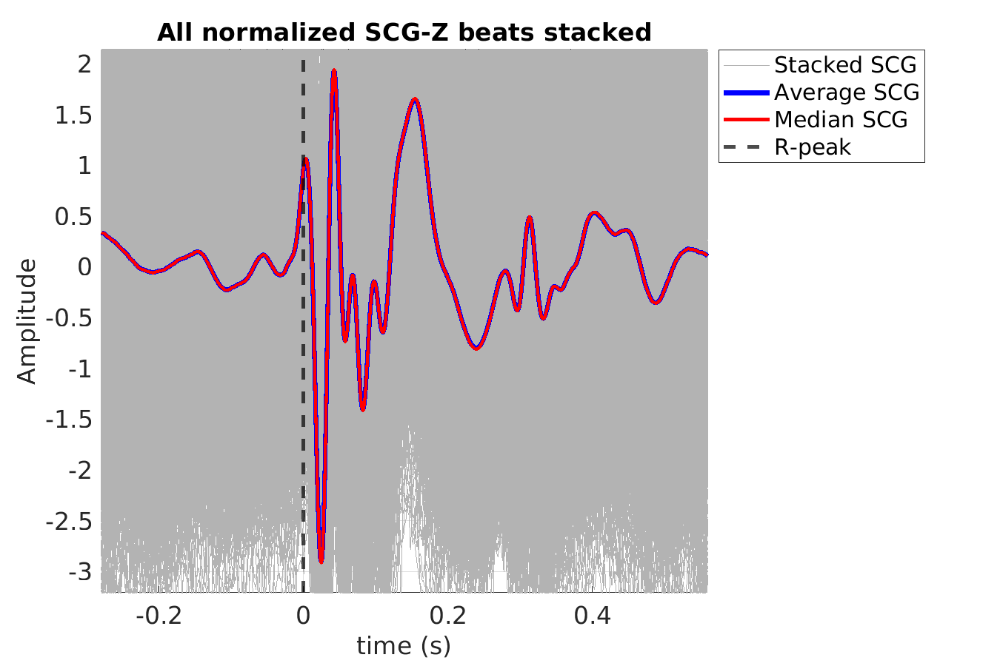

## S028_scg_avg_ecg_scg
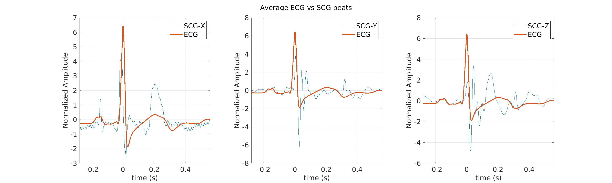

## S028_scg_med_ecg_scg
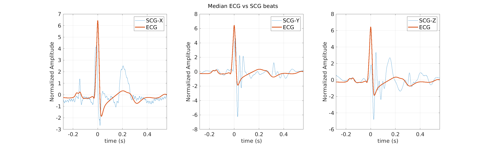
