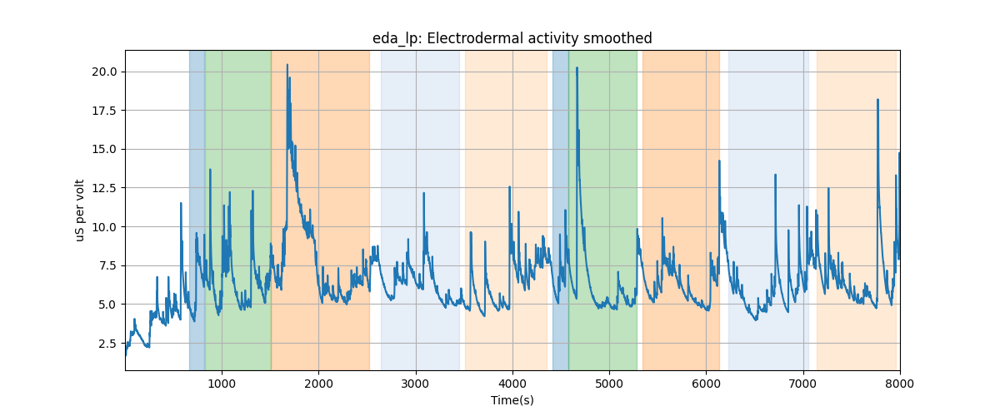
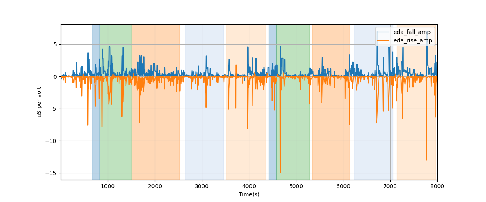
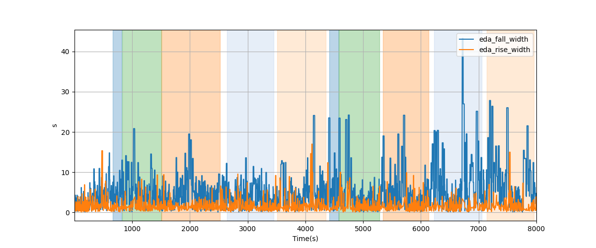
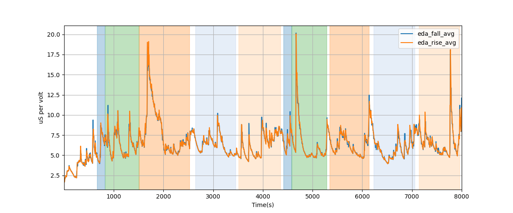

# Subject S029 Electrodermal Activity Data Processing Summary
Generated on 2024-09-11 22:34:05

## eda: Electrodermal activity

## eda_lp: Electrodermal activity smoothed

---
# EDA segment falling/rising wave amplitudes

---
# EDA segment falling/rising wave durations

---
# EDA segment falling/rising wave average amplitudes

---
# EDA segment falling/rising wave median amplitudes

